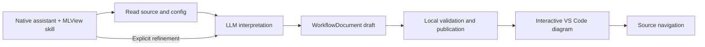

# MLView

[](https://github.com/realmyang/MLView/actions/workflows/ci.yml)
[](LICENSE)

**Use the LLM in your existing VS Code assistant to understand an ML workflow,
then explore its source-linked interactive diagram.** MLView provides a skill
for GitHub Copilot, Codex, and Claude Code, a common artifact format, and a
VS Code viewer. Your assistant reads the source and configuration, interprets
the workflow, and authors the diagram and findings.

MLView requires no separate model API key. The selected assistant supplies the
model, tools, permissions, and source-processing policy. Local helpers validate
citations and structure; the viewer displays the result. Neither helper nor
viewer executes the analyzed program. Citation validation does not prove the
model's interpretation correct.

This is an **experimental implementation**. See [implementation and validation
status](docs/LLM_IMPLEMENTATION.md) for what has actually been tested. The old
static analyzer remains available as an explicitly separate legacy path; its
accuracy figures do not measure the LLM workflow.

## Get a diagram

The detailed install and refinement instructions are in
[LLM_WORKFLOW.md](docs/LLM_WORKFLOW.md). From this checkout, with Python 3.10+
and Node 20+:

```sh
cd webview && npm ci && npm run build && cd ..
python3 tools/sync-assets.py
cd vscode-extension && npm ci && npm run package && cd ..
python3 tools/install_skill.py /path/to/your/project
```

Install the generated VSIX using VS Code's **Extensions: Install from VSIX**.
The installer copies the self-contained skill into the target project's
`.agents/skills/mlview/` directory for Codex and Copilot. For Claude Code, use
the [Claude plugin](claude-plugin/README.md) or the workspace install described
in the runbook. Only install one copy of the skill in each discovery path.

1. Open the target project in VS Code and invoke `mlview` in your assistant's
   skill picker (`$mlview` in Codex). Ask, for example:
   “Explain training with this config. Show data, model, losses, parameter
   updates, validation, and anything unresolved.”
2. The assistant publishes a `*.mlview.json` file. Run **MLView: Open Generated
   Diagram** and select it. Click nodes, edges, or evidence links to inspect the
   cited source.
3. Ask the same assistant to refine the diagram. A valid new revision updates
   the panel; filtering and navigating the existing diagram do not call an LLM.

The workflow supports custom phases, nested groups, branches and cycles,
notebook cell references, and findings with evidence and counter-evidence.
Observed, inferred, and unresolved claims remain distinguishable. Source edits
invalidate citations; malformed updates retain the last valid diagram.

## How it works

Try the [native Codex-generated example](samples/configured_training.mlview.json)
from this repository's workspace. Its [validation log](docs/demo-logs/2026-09-16-llm-workflow.md)
records native model invocations, citation checks, live navigation/refinement
and remaining acceptance checks.



The portable skill is in [skills/mlview](skills/mlview/SKILL.md). The authoring
format is [WorkflowDocument 1.0](docs/WORKFLOW_CONTRACT.md), with its
[JSON Schema](contracts/workflow.schema.json). The new artifact lifecycle
bypasses the Python static analyzer. Generated JSON is data, never a script or
an instruction to the viewer.

## Legacy static workflow

The dependency-free Python analyzer, old reports, rule catalog, and static
host commands remain available for compatibility:

```sh
python3 -m pip install -e analyzer
python3 -m mlview analyze samples/vision_pipeline --html report.html
python3 -m mlview issues samples/vision_pipeline --min-severity high
```

Legacy scope selectors are `unit:`, `symbol:`, `stage:`, `file:`, `concern:`,
`pipeline:`, `node:`, and `all`, with `--depth` 0–2. Legacy Copilot tools such as
`#mlviewAnalyze` still invoke static analysis. They are not the native MLView
skill. See the [analyzer reference](analyzer/README.md), [legacy accuracy
measurements](docs/ACCURACY.md), and [legacy validation runbook](docs/VALIDATION.md).

## Development

Use a Python 3.10+ virtual environment on PATH. The local macOS default may be
older. Component suites and the new skill checks run without an ML framework:

```sh
python -m pytest skills/mlview/tests tools/test_install_skill.py evals -q
python tools/verify.py --all
python scripts/check_docs.py
cd webview && npm run check && npm test
cd ../vscode-extension && npm run check && npm test
```

See [CONTRIBUTING.md](CONTRIBUTING.md), [the approved direction](docs/LLM_DIRECTION_PLAN.md),
[security boundaries](SECURITY.md), and [the documentation index](docs/README.md).
The CI badge reports the default branch, not this unmerged implementation.
