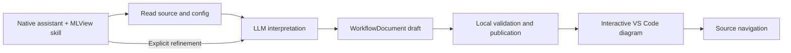

# MLView

[](https://github.com/realmyang/MLView/actions/workflows/ci.yml)
[](LICENSE)

**Use the LLM in your existing VS Code assistant to understand an ML workflow,
then explore its source-linked interactive diagram.** MLView provides a skill
for GitHub Copilot, Codex, and Claude Code, a common artifact format, and a
VS Code viewer. Your assistant reads the source and configuration, interprets
the workflow, and authors the diagram and findings.

MLView requires no separate model API key. The selected assistant supplies the
model, tools, permissions, and source-processing policy. Local helpers validate
citations and structure; the viewer displays the result. Neither helper nor
viewer executes the analyzed program. Citation validation does not prove the
model's interpretation correct.

This is an **experimental implementation**. See [implementation and validation
status](docs/STATUS.md) for what has actually been tested. Workflow interpretation
and findings come from the active assistant model.

## Get a diagram

The detailed install and refinement instructions are in
[LLM_WORKFLOW.md](docs/LLM_WORKFLOW.md). From this checkout, with Python 3.10+
and Node 20.18.1+:

```sh
cd webview && npm ci && npm run build && cd ..
python3 tools/sync-assets.py
cd vscode-extension && npm ci && npm run package && cd ..
python3 tools/install_skill.py /path/to/your/project
```

Install the generated VSIX using VS Code's **Extensions: Install from VSIX**.
The installer copies the self-contained skill into the target project's
`.agents/skills/mlview/` directory for Codex and Copilot. For Claude Code, use
the [Claude plugin](claude-plugin/README.md) or the workspace install described
in the runbook. Only install one copy of the skill in each discovery path.

1. Open the target project in VS Code and invoke `mlview` in your assistant's
   skill picker (`$mlview` in Codex). Ask, for example:
   “Explain training with this config. Show data, model, losses, parameter
   updates, validation, and anything unresolved.”
2. The assistant publishes a `*.mlview.json` file. Run **MLView: Open Generated
   Diagram** and select it. Click nodes, edges, or evidence links to inspect the
   cited source.
3. Ask the same assistant to refine the diagram. A valid new revision updates
   the panel; filtering and navigating the existing diagram do not call an LLM.

To refine a particular node, edge, or finding, select it and use **Refine →
Copy prompt**. Choose an intent or enter a specific question, then paste the
prompt into the same assistant. The diagram header shows the entrypoints and
configuration being explained.

The Inspector brings together claim basis, source quotes, counter-evidence and
coverage limitations. **Challenge this claim** prepares a focused refinement
request. The Outline's textual relationships provide All, Incoming, Outgoing
and Unresolved views alongside the diagram.

The workflow supports custom phases, nested groups, branches and cycles,
notebook cell references, and findings with evidence and counter-evidence.
Observed, inferred, and unresolved claims remain distinguishable. Saved source
edits mark the affected citations stale and block jumps into those files;
malformed updates retain the last valid diagram.

## How it works

Try the [native Codex-generated example](samples/configured_training.mlview.json)
from this repository's workspace. Its [validation log](docs/demo-logs/2026-09-16-llm-workflow.md)
records native model invocations, citation checks, live navigation/refinement
and remaining acceptance checks.



The portable skill is in [skills/mlview](skills/mlview/SKILL.md). The authoring
format is [WorkflowDocument 1.0](docs/WORKFLOW_CONTRACT.md), with its
[JSON Schema](contracts/workflow.schema.json). Generated JSON is data, never a script or an instruction to the viewer.

The dated 2026-09-18 [quality sprint](docs/QUALITY_SPRINT.md) records the skill
improvements and development follow-ups of that date. Its [review ledgers](evals/workflow/development/native-reviews/README.md)
cover twelve native artifacts and three no-skill baselines; their semantic
judgments remain provisional until human review.

The [trust and usability campaign](docs/TRUST_USABILITY_CAMPAIGN.md) adds evidence
review, validation scheduling, interpretation aids and reproducible performance
and candidate checks. It preserves WorkflowDocument 1.0; it does not establish
semantic accuracy or complete the human-reviewed pilot.

## Development

Use a Python 3.10+ virtual environment on PATH. The local macOS default may be
older. Component suites and the new skill checks run without an ML framework:

```sh
python -m pip install -r requirements-dev.txt
sh scripts/e2e.sh
```

The full check builds and tests the skill and viewer, validates evaluation
records, and inspects packaged skill ZIPs and the VSIX. On Windows use
`powershell -File scripts/e2e.ps1`.

See [CONTRIBUTING.md](CONTRIBUTING.md), [current status](docs/STATUS.md),
[security boundaries](SECURITY.md), and [the documentation index](docs/README.md).
The CI badge reports the default branch, not this unmerged implementation.
