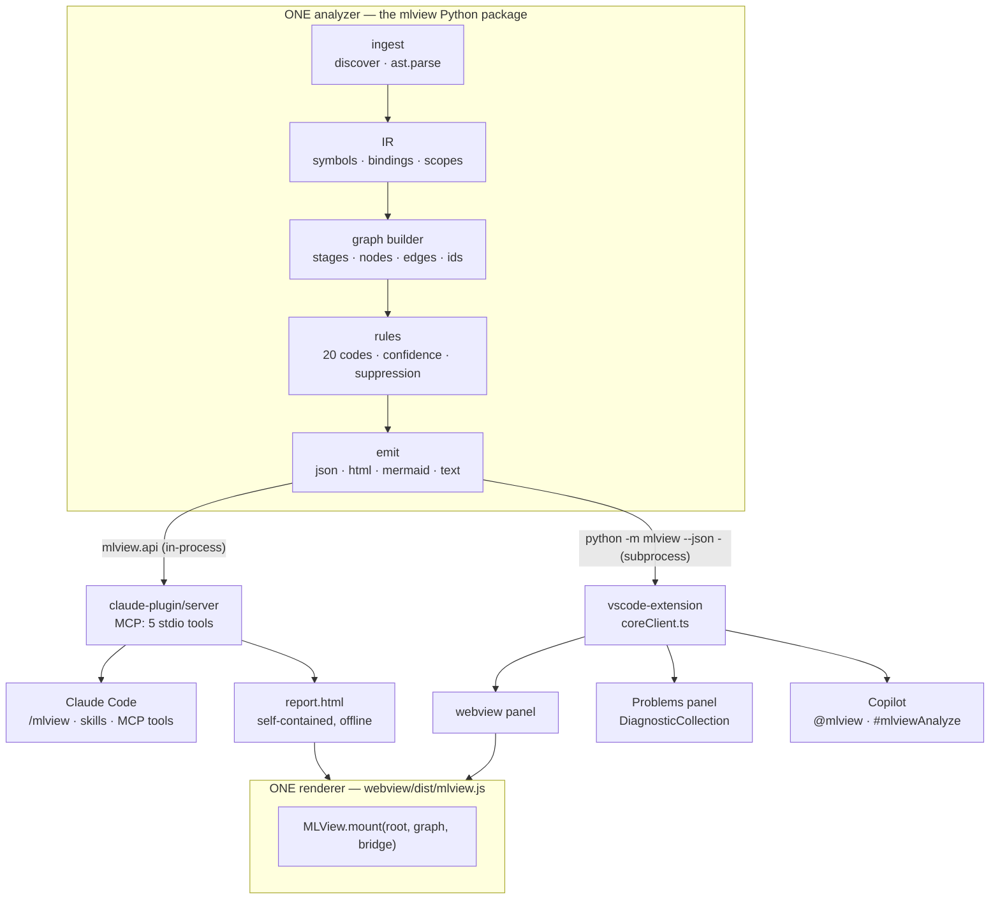

# MLView

[](https://github.com/realmyang/MLView/actions/workflows/ci.yml)

**Turn a Python machine-learning codebase into one interactive, issue-annotated
workflow diagram — and serve that identical diagram to two hosts: Claude Code and
GitHub Copilot / VS Code.**

Everything is static. MLView parses source with `ast`; it never imports, executes
or `exec`s the code it reads, and **torch and scikit-learn do not need to be
installed** — the machine this was built on has neither. Everything works offline:
no network at analysis, render or load time.

MLView answers, in the first ninety seconds of reading unfamiliar training code,
the four questions an ML reviewer actually asks: where does data enter and where
is it split, what is being optimized and by what, is the evaluation honest, and
what is wrong — how badly and on which line.

---

## The four spec requirements, and how they are met

| # | Requirement | How |
|---|---|---|
| **1** | **Visualize the complete logic / workflow** | A stage-labelled graph recovered by static analysis: eight canonical stages (`config → data → preprocess → model → objective → train → eval → deliver`) as swimlane bands, a three-level hierarchy (stage › unit › op), four typed edge kinds (`data`, `call`, `control`, `config`), and the training loop drawn *as a loop* with labelled back-edges. Stages that are absent are **declared, not dropped** — a missing `eval` lane is itself a finding. |
| **2** | **The diagram is interactive; clicking leads to the code** | Every node, edge and issue carries `{file, absFile, line, col, endLine, endCol, symbol, snippet}` — line 1-based, column 0-based, converted exactly once at the host boundary. Clicking a node opens the file with the range selected; clicking an **edge** lands on the *call site* that created the dependency, not on either endpoint's definition; an issue exposes its related locations as named secondary jumps ("go to the split site"). |
| **3** | **Potential issues are marked on the diagram** | Twenty rules (`MLV1xx` leakage, `MLV2xx` train loop, `MLV3xx` evaluation, `MLV4xx` loss, `MLV5xx` device, `MLV6xx` reproducibility, `MLV7xx` model) attach severity-marked badges to the exact node or edge. A **required-but-absent** step — a missing `optimizer.zero_grad()`, a missing `model.eval()` — is drawn as a dashed **ghost node** in its correct slot, so the diagram shows the hole rather than narrating it. Every finding carries a rule code, a confidence bucket, a message citing real variable names, and a one-sentence fix. |
| **1a** | **The flow is visible** | Hover a connection and it lights up while a charge runs along it **from outlet to inlet**, the way current runs through a cable; hover a node and its whole lineage streams, staggered 90 ms per hop. Direction is never guessed — every route is emitted source → target, so animating along the edge's own path *is* the direction. The charge takes the severity colour on an edge that carries a finding, so the wrong tensor is the one you watch move into the loss. Under `prefers-reduced-motion`, or above 120 lit edges, the same information is a static chevron plus an outlet and an inlet dot. |
| **1b** | **You can visualize part of a codebase** | One selector narrows every surface to one part of the pipeline: `unit:SmallCNN`, `unit:train_test_split`, `stage:train`, `file:data.py`, `concern:evaluation`, `node:<id>`, with `depth` 0–2 boundary hops. It is a **view, not a filter**: the Problems panel, `stage.present`, `workspace` and `generator` still describe the whole analysis, and the breadcrumb always says `N of M nodes` with `M` the project's real size. |
| **4** | **The UI/UX is beautiful, clear, intuitive** | One renderer, three severity marker *shapes* (not only colours, so it survives a greyscale screenshot), a collapsed default view that fits one screen, an issue rail ranked by severity, and design tokens written as `var(--vscode-*, <literal>)` so the same CSS is correct in a VS Code webview, in a light browser and in a dark one. |

The honest counterweight to that table is the [status section](#status--what-is-actually-verified) below.

---

## Quick start

Build once. It takes about a minute and needs no network beyond the npm cache.

```powershell
powershell -ExecutionPolicy Bypass -File scripts/build.ps1
```

```sh
sh scripts/build.sh
```

### Claude Code

```bash
claude plugin validate ./claude-plugin --strict     # always validate first
claude --plugin-dir C:/absolute/path/to/MLView/claude-plugin
```

Then, in the session:

```
/mlview samples/vision_pipeline        # analyze, summarize, open the diagram
/mlview-issues samples/vision_pipeline high

/mlview samples/vision_pipeline --scope concern:evaluation
/mlview samples/vision_pipeline --scope unit:SmallCNN --depth 1
/mlview-issues samples/vision_pipeline low --scope stage:train
```

**Grouping from an agent.** `mlview_issues {groupBy: "rule"}` (and
`/mlview-issues --group-by rule|file|severity`) folds the findings into one row
per rule, file or severity with an occurrence count, the worst severity and
confidence, and up to three citable `file:line` sites. On an inherited repo the
flat list is eleven codes repeated ten times, and the 4 KB payload budget then
sheds rows until the answer is both long and incomplete. Grouping **folds** the
rows, it never filters them, and the payload's `note` says so.

**Scoping from an agent.** `mlview_graph {scope: "units"}` returns the catalogue
of everything that can be scoped to — one row per class, function and loop with
its file, line, node count and worst severity — so the model picks a real name
instead of guessing one. `mlview_analyze`, `mlview_issues` and
`mlview_open_diagram` then take the same `scope` and `depth`. There are **still
exactly five tools**; a scoped result says it is scoped, and `graphPath` keeps
pointing at the full document, so widening back costs nothing.

`/mlview` prefers the five `mlview_*` MCP tools and **falls back to the CLI
through `Bash`** when they are unavailable, so the demo does not depend on MCP
registration succeeding. The plugin needs no `pip install` of MLView itself —
`.mcp.json` puts `claude-plugin/vendor` on `PYTHONPATH`. See
[`claude-plugin/README.md`](claude-plugin/README.md) for the marketplace install,
the tool reference and Windows troubleshooting.

### VS Code / GitHub Copilot

```
scripts/build.ps1          # or scripts/build.sh
code vscode-extension      # open the folder, then press F5
```

F5 launches an Extension Development Host. Open a Python ML project in it, then:

- **Commands** (`Ctrl+Shift+P` → "MLView"): `Visualize ML Workflow (Current File)`
  · `(Workspace)` · `Re-analyze` · `Show ML Issues` · `Reveal in Diagram`
  (`Alt+M`, also on the editor context menu) · `Scope Diagram to Symbol`
  (`Alt+Shift+M`, also on the editor context menu — it scopes the panel to the
  unit the cursor is inside) · `Clear Diagram Scope` · `Export HTML` ·
  `Select Interpreter` · `Show Output` · `Show Rule Doc`.
- **Problems panel** — findings at or above `mlview.minConfidence` (default 0.6)
  are published as diagnostics with `source: "MLView"`, the rule code linking to
  a **local** offline doc page, and `relatedInformation` for every related site.
  Analysis runs on save by default (`mlview.analyzeOnSave`).
- **Current file, whole picture.** `Visualize (Current File)` analyses the
  **package directory** around the file and then scopes the diagram to the file
  (`mlview.currentFileAnalysisScope`, default `package`; `file` and `workspace`
  are the other two). Analysing a file alone cannot fire MLV301, MLV302, MLV401
  or MLV501 — each needs a sibling module — so the old behaviour lost four of
  seven findings on `train.py` and said nothing about it. Set it back to `file`
  and the analyzer's `single_file_analysis` diagnostic says which rules could not
  run.
- **A blind run says so.** `single_file_analysis` and `untagged_dataflow` reach
  the status-bar tooltip, the panel tab (`coverage: incomplete (N blind spots)`)
  and the chat / language-model digests, which tell the model the count is a floor
  rather than a clean bill of health
  (`vscode-extension/src/coverage.ts`).
- **Copilot Chat** — `@mlview` with `/diagram`, `/issues` and `/explain`. Every
  finding streamed into chat is followed by an anchor, so it is a click into the
  source.
- **Copilot agent mode** — `#mlviewAnalyze`, `#mlviewIssues` and `#mlviewDiagram`
  reference the three language-model tools directly in a prompt.

Both chat surfaces register behind a feature check and a `try`/`catch`, so a
chat-API change can never break activation of the diagram, the diagnostics or the
reveal.

### Or just the CLI

```bash
python -m pip install -e analyzer
python -m mlview analyze samples/vision_pipeline --json .mlview/graph.json --html .mlview/report.html --open
python -m mlview issues  samples/vision_pipeline --min-severity high
python -m mlview explain MLV201
python -m mlview analyze --demo --json -          # the golden sample document

python -m mlview analyze samples/vision_pipeline --list-scopes
python -m mlview analyze samples/vision_pipeline --scope unit:train_test_split --html .mlview/split.html --open
python -m mlview analyze samples/vision_pipeline --scope concern:optimization --format summary
python -m mlview analyze samples/vision_pipeline --scope concern:evaluation --depth 1 --format mermaid
python -m mlview issues  samples/vision_pipeline --scope stage:train
python -m mlview render  --graph .mlview/graph.json --scope unit:SmallCNN --format mermaid
```

`--scope` takes one selector and `--depth` its 0–2 boundary hops; `--list-scopes`
prints the catalogue of scopable units. An unusable selector exits `1` with
nothing on stdout and the code, the offending term and up to ten candidates on
stderr. An `--html` report always embeds the **whole** graph and merely opens
*at* the scope, so the reader can widen it in the toolbar, and an unscoped run is
byte-identical to what it produced before the feature existed.

**In the report or the panel:** hover a connection to watch the value travel
along it; press `e` / `Shift+E` to walk the selected node's connections; press
`s` to scope to the selection, `[` / `]` to change the depth, and `Shift+S` or
`Esc` to leave.

Exit codes: `0` ok · `1` usage or I/O · `2` `--fail-on` threshold exceeded ·
`3` internal error · `4` nothing analyzable. stdout carries **only** the requested
payload; every log line goes to stderr.

---

## Architecture



**Three frozen seams**, and nothing crosses them informally:

1. **The process seam** — `python -m mlview analyze <path> --json -`. Both hosts
   call exactly this. Nothing else parses Python.
2. **The in-process seam** — `mlview.api`. The MCP server imports it rather than
   shelling out to itself, so argument handling cannot diverge.
   `tools/verify.py --parity` byte-diffs the two documents anyway.
3. **The render seam** — `window.MLView.mount(el, graph, bridge)`. The only
   host-specific code in the viewer is a seven-method `HostBridge`.

### Directory map

```
MLView/
  docs/                     REQUIREMENTS · ARCHITECTURE · ISSUE_RULES · UX_DESIGN · CONTRACTS
  contracts/                FROZEN: graph.schema.json · graph.sample.json
  analyzer/                 the Python package `mlview` — the ONE analyzer
    src/mlview/             ingest · ir · core · knowledge · rules · emit · schema
    tests/                  core · rules · fixtures · clean corpus
  webview/                  the ONE renderer; dist/mlview.{js,css} is the bundle
  vscode-extension/         panel · diagnostics · reveal · chat · LM tools
  claude-plugin/            plugin.json · .mcp.json · commands · skills · server · vendor
  samples/                  vision_pipeline (dirty) + vision_pipeline_clean (twin)
  tools/                    sync-assets.py · sync-core.py · verify.py
  scripts/                  build · e2e (PowerShell and sh) · the doc gate
  .claude-plugin/           marketplace.json — the repo doubles as a local marketplace
  .mlview/                  generated output (graph.json, report.html)
```

**One agent owns each directory** and no agent writes into another's.
`tools/sync-assets.py` is the only thing that writes `vscode-extension/media/`
and `analyzer/src/mlview/emit/assets/`; `tools/sync-core.py` is the only thing
that writes `claude-plugin/vendor/`.

---

## Tests

```bash
PYTHONUTF8=1 python -m pytest analyzer/tests -q        # analyzer core + rules
PYTHONUTF8=1 python -m pytest claude-plugin/tests -q   # MCP handshake, budgets, manifests
cd webview && npm test                                 # layout, bundle hygiene, parity, contrast
cd vscode-extension && npm test                        # protocol, ranges, CSP, digest, mapping
```

The whole thing, plus the samples and the parity gates, in one table:

```powershell
powershell -ExecutionPolicy Bypass -File scripts/e2e.ps1
```

```sh
sh scripts/e2e.sh
```

### Continuous integration

`.github/workflows/ci.yml` runs the gate table on every push and pull request,
so "it works" is a statement about eight machines rather than about one:

| Job | Runner | What it runs |
|---|---|---|
| `analyzer` | ubuntu x Python 3.10 / 3.11 / 3.12 / 3.13 | the analyzer suite, `contracts/validate_sample.py`, and `--demo` compared byte for byte against `contracts/graph.sample.json` |
| `claude-plugin` | ubuntu, Python 3.13 | the plugin suite under `pytest -n auto`, then `tools/sync-core.py --check` |
| `webview` | ubuntu x Node 20 / 22 | `npm run check`, `build`, `test`, then `tools/sync-assets.py --check` against the bundle just built |
| `vscode-extension` | ubuntu, Node 20 | `npm run check`, `compile`, `test`, and the doc gate with its self-test |
| `e2e (ubuntu, sh)` | ubuntu, Python 3.13 + Node 20 | `sh scripts/e2e.sh` — all 17 steps, uploading the emitted reports |
| `e2e (windows, powershell)` | windows, Python 3.13 + Node 20 | `scripts/e2e.ps1` — the same 17 steps under the other driver |
| `smoke (macos)` | macos, Python 3.13 + Node 20 | the analyzer and viewer suites |
| `accuracy corpus` | ubuntu, Python 3.13 | `tools/accuracy.py` over the ten labelled programs, then `pytest analyzer/tests/accuracy` — zero `forbidden` findings, and recall and graph fidelity may only ratchet up |

The matrix is deliberately lopsided: the repository is private, so minutes are
metered and weighted (windows 2x, macos 10x), and the fan-out is therefore
ubuntu-only. A full green run is about 3m40s of wall time and ~41 billable
minutes. `claude plugin validate` is not available on a hosted runner; the test
that would call it skips itself when the CLI is absent, so gates 10 and 11 of
`scripts/README.md` are still Windows-desk gates.

### The three parity gates

`tools/verify.py` is what stops the two hosts from slowly acquiring different
analyzers or different viewers:

```bash
python tools/verify.py --all
```

1. **One analyzer** — the CLI document and the document produced by a real MCP
   `tools/call` (driven as a subprocess over stdio) are byte-identical after
   stripping `generator.generatedAt` and `stats.durationMs`, the only two fields
   the contract allows to vary.
2. **One renderer** — `mlview.js` and `mlview.css` are SHA-256-identical across
   `webview/dist/`, `vscode-extension/media/` and
   `analyzer/src/mlview/emit/assets/`, and a freshly emitted document's
   `generator.rendererSha` equals that hash. A drifted viewer is detectable from
   the data alone.
3. **One version** — the same version string in `mlview.version`,
   `analyzer/pyproject.toml`, `vscode-extension/package.json`,
   `claude-plugin/.claude-plugin/plugin.json` and `webview/package.json`.

Gate 1 runs the CLI against `analyzer/src` and the server against
`claude-plugin/vendor` **on purpose**, so a stale vendored copy shows up as a
behavioural difference rather than only as a file-hash mismatch; the table
carries a `vendor: synced core` row alongside it saying which of the two it was.

---

## Status — what is actually verified

This is a prototype built in one session. The distinction between "works" and
"compiles" is kept honest here.

**Exercised end to end on this machine (Windows 11, Python 3.13, Node 20.9,
VS Code 1.136):**

- The analyzer core and its rules, with the full pytest suite green.
- The Claude Code plugin: a real stdio handshake with the MCP server, spawned as
  a subprocess with `PYTHONPATH` pointing only at `vendor/` — which also proves
  the no-`pip install` path.
- The CLI, including `--demo` emitting `contracts/graph.sample.json`
  byte-identically, and every documented exit code.
- The self-contained HTML report: one file, zero external references — including
  the three scoped demo reports (`.mlview/split.html`, `optimization.html`,
  `evaluation.html`).
- All four parity gates, the scope gate included: the ten-selector battery in
  `contracts/scope.cases.json` projects identically through the Python
  `analyzer/src/mlview/core/project.py` and the TypeScript
  `webview/src/scope/project.ts` (`python tools/verify.py --scopes`).

**Compile-verified only:**

- **GitHub Copilot is not installed on this machine.** The chat participant
  (`@mlview`) and the three language-model tools are contributed correctly, type-
  check clean, and each tool body is extracted into a pure function that is
  smoke-tested with `vscode` mocked — but they have never been invoked by a real
  Copilot agent. **The exercised Copilot surface is the `DiagnosticCollection`**:
  findings in the Problems panel are what a Copilot agent reads today, and that
  path is tested.
- The VS Code extension is verified by `tsc --noEmit` and its unit suite; the F5
  Extension Development Host path has not been run under automation.

**Known gaps:**

- The scoped jsdom render step in `scripts/e2e.sh` reports SKIP until
  `tools/sync-assets.py` has run: a report written before the sync inlines the
  previous viewer bundle, which has no scope UI to assert against. The
  bundle-hash rows of `tools/verify.py` report the same one cause, and a full
  `scripts/build` followed by `scripts/e2e` never hits it.
- `--list-scopes` lists scopable **units** only
  (`analyzer/src/mlview/emit/scope_out.py`). The four concerns and the eight
  stage ids are discovered from this README, from the MCP tool description, or
  from the candidate list an unusable selector prints — not from that command.
- Both sample workspaces and all twenty rule pages under `docs/rules/` are on
  disk now, so the degradation paths written for a checkout without them --
  `scripts/e2e` reporting `SKIP` instead of failing, `tools/verify.py` falling
  back to the rule fixtures as its parity corpus, `mlview_explain <code>`
  returning the rule's registry record instead of a doc page -- are never taken
  by a normal run, and nothing tests them.
- Loop nesting is flattened one level: a batch loop inside an epoch loop is
  parented to the enclosing function unit, not to the epoch loop. Frozen
  invariant 1.1.2 (a parent must have a strictly lower level) plus a three-value
  level enum cannot express four levels of real nesting. The true nesting
  survives in the IR -- `LoopIR.depth` and `LoopIR.parent_loop` in
  `analyzer/src/mlview/ir/model.py` -- it just cannot be drawn.
- Cross-file call following is one level and module-local, as the contract
  specifies: `analyzer/src/mlview/ir/resolve.py` fills `target_function` for a
  call into a workspace module, and stops there. A rule cannot chase a helper
  that a helper calls.
- Notebooks are counted and declared, never analyzed: the run reports them as
  `notebooksSkipped` and a `notebook_skipped` diagnostic, and no cell is parsed.
- Bindings are flow-insensitive within a scope (`analyzer/src/mlview/ir/bindings.py`);
  rules that care about ordering compare line numbers explicitly.
- `analysisProgress` is never posted. The CLI emits no progress frames, so the
  viewer shows an indeterminate spinner rather than "Parsing 42 of 128 files".
  The webview handler for the frame exists and is tested; nothing sends it.
- The host renders the coverage caveat as text only — the status-bar tooltip, the
  panel tab description and the digests (`vscode-extension/src/coverage.ts`). The
  in-canvas banner and chip are the viewer's, drawn from `graph.diagnostics` in
  `webview/src/ui/chrome.ts`, which the host passes through untouched.
- `mlview_issues`'s `groupBy` folds the rows inside the MCP server
  (`claude-plugin/server/mlview_groups.py`), which is where the plugin's grouping
  lives. `/mlview-issues --group-by` therefore groups through the MCP tool; its
  `Bash` fallback line groups only once the matching `--group-by` flag lands on
  `analyzer/src/mlview/cli.py`.
- The framework gate on the absence rules (`MLV301`, `MLV302`, `MLV501`, ...)
  reaches one import hop, no further. `ctx.wrappers_for()` in
  `analyzer/src/mlview/rules/context.py` de-rates a finding only when a
  Lightning / HF Trainer / accelerate / ignite / fastai / DDP / FSDP wrapper is
  in the finding's *own* module or in a workspace module that one imports, so a
  wrapper two hops away is invisible to it and the finding keeps full weight.
  When the gate does fire it caps severity at `medium`, multiplies confidence by
  0.4 and says so in a `framework_suppressed` diagnostic; it never deletes a
  finding.
- `MLV201`'s `negation_absent` evidence line is written off the workspace-wide
  `ctx.wrappers` rather than the per-module set the gate actually uses
  (`analyzer/src/mlview/rules/r_trainloop.py`), so an ungated hand-written loop
  in a workspace that also contains a Lightning module reads "framework wrapper
  detected: Lightning" next to a `certain` finding. The score is right; that one
  evidence sentence contradicts it.

---

## Design documents

Four of the five are **plan records**: they say what was *decided*, not what was built, and `scripts/check_docs.py` link-checks them and nothing else so that editing one to match the code cannot quietly erase a decision (it fails the run on a sentence in one that reports build state). What the software actually does today is this file, `docs/STATUS.md` and `scripts/README.md`, all three of which the doc gate holds to the tree.

| Document | What it settles |
|---|---|
| [`docs/REQUIREMENTS.md`](docs/REQUIREMENTS.md) | What must be true when we are done, as testable acceptance criteria |
| [`docs/ARCHITECTURE.md`](docs/ARCHITECTURE.md) | The seven analyzer passes, the three seams, directory ownership |
| [`docs/CONTRACTS.md`](docs/CONTRACTS.md) | **Normative.** The schema, the CLI, the MCP tools, the message protocol. Section 10 overrides everything above it. |
| [`docs/ISSUE_RULES.md`](docs/ISSUE_RULES.md) | The twenty rules, their evidence and their false-positive traps |
| [`docs/UX_DESIGN.md`](docs/UX_DESIGN.md) | Layout, tokens, markers, states, interaction |

License: MIT.
