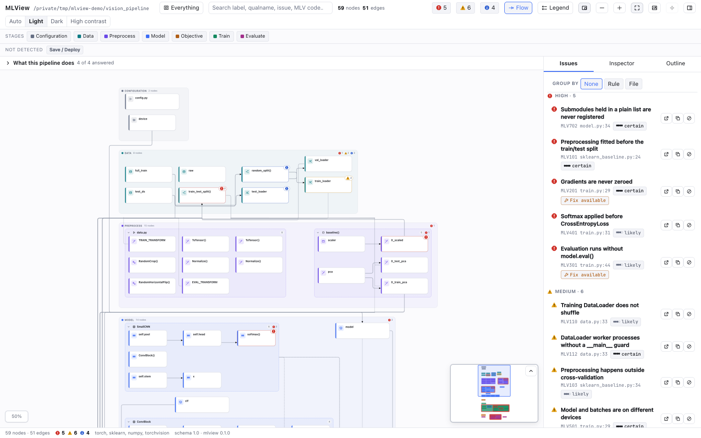
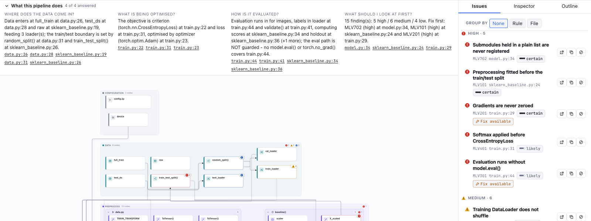
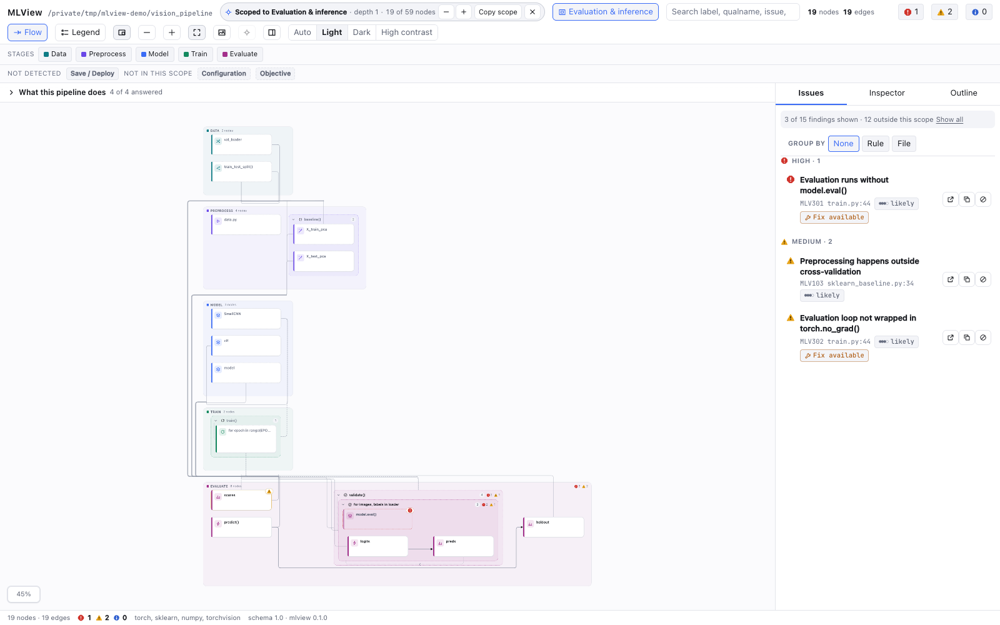

# MLView

[](https://github.com/realmyang/MLView/actions/workflows/ci.yml)
[](LICENSE)
[](docs/VALIDATION.md)
[](docs/STATUS.md)

**MLView turns a Python machine-learning codebase into one interactive,
issue-annotated workflow diagram, and serves that identical diagram to three
hosts: a self-contained HTML report, VS Code / GitHub Copilot, and Claude Code.**
It is a static analyzer — it parses source with `ast` and never imports,
executes or `exec`s the code it reads, so torch and scikit-learn do not have to
be installed and nothing touches the network at analysis, render or load time.
It exists to answer, in the first ninety seconds of reading unfamiliar training
code, the four questions an ML reviewer actually asks: where does data enter and
where is it split, what is being optimized and by what, is the evaluation
honest, and what is wrong — how badly and on which line.



*The shipped sample, `samples/vision_pipeline`: 59 nodes, 51 edges, 15 findings
(5 high / 6 medium / 4 low), in one self-contained HTML file with zero external
references. Its corrected twin `samples/vision_pipeline_clean`, 70 nodes, reports none.*

---

## Ninety seconds

Everything below is copied from [`docs/VALIDATION.md`](docs/VALIDATION.md), the
runbook used to check MLView by hand on a machine it was not built on.

### The command line

```sh
git clone https://github.com/realmyang/MLView && cd MLView
python3 -m venv .venv && . .venv/bin/activate      # Windows: py -3 -m venv .venv
python -m pip install -e analyzer
sh scripts/build.sh                                # Windows: scripts/build.ps1

python -m mlview analyze samples/vision_pipeline --format summary
python -m mlview analyze samples/vision_pipeline --html report.html --open
python -m mlview issues  samples/vision_pipeline --min-severity high
python -m mlview explain MLV101                    # the rule page, offline
```

Requirements: **Python 3.10+** (3.11+ to read a `.mlview.toml`, which needs
`tomllib`) and **Node 20+** to build the viewer bundle. No ML framework is
needed — a machine with neither torch nor scikit-learn installed is a *better*
test of MLView, not a worse one.

### VS Code / GitHub Copilot

```sh
cd vscode-extension && npm install && npm run compile
code .                                             # then press F5
```

F5 opens an Extension Development Host; `npm run package` builds a VSIX to
install instead. **No `pip install` is required** — the VSIX bundles the
analyzer. Then: `MLView: Visualize ML Workflow (Workspace)`, findings in the
**Problems** panel, `Alt+M` to reveal the symbol under the cursor in the
diagram, `Alt+Shift+M` to scope the diagram to it, `@mlview` in Copilot Chat and
`#mlviewAnalyze` in agent mode. Nineteen commands, sixteen settings and the
troubleshooting reference:
[`vscode-extension/README.md`](vscode-extension/README.md).

### Claude Code

```sh
python -m pip install mcp                          # the SDK the server imports
export MLVIEW_PYTHON="$(command -v python || command -v python3)"   # 3.10+, absolute

claude plugin validate ./claude-plugin --strict
claude --plugin-dir /absolute/path/to/MLView/claude-plugin
```

Then, in the session:

```
/mlview samples/vision_pipeline                    # analyze, summarize, open the diagram
/mlview-issues samples/vision_pipeline high
/mlview samples/vision_pipeline --scope concern:evaluation --depth 1
```

Five MCP tools (`mlview_analyze`, `mlview_issues`, `mlview_graph`,
`mlview_open_diagram`, `mlview_explain`), each answer ≤ 4 KB, and a
`PostToolUse` hook that speaks only when your edit *added* a finding. MLView
itself needs no `pip install` here either: `.mcp.json` puts
`claude-plugin/vendor` on `PYTHONPATH`. Full reference:
[`claude-plugin/README.md`](claude-plugin/README.md).

---

## What it finds

36 rules, in eight families, each attaching a severity marker to the exact node
or edge it is about rather than to a list beside the diagram:

| Family | Count | What it is about |
|---|---|---|
| `MLV1xx` | 9 | Leakage and data handling: a transform fitted before the split or on test data, preprocessing outside cross-validation, a random split on temporal data, an unshuffled training `DataLoader` |
| `MLV2xx` | 8 | The training loop: gradients never zeroed, gradients computed but never applied, `optimizer.step()` before `loss.backward()`, loss accumulated without `.item()`, clipping in the wrong position |
| `MLV3xx` | 4 | Evaluation: a validation pass without `model.eval()` or `torch.no_grad()`, a class metric computed on raw scores instead of predicted classes |
| `MLV4xx` | 2 | The objective: softmax before `CrossEntropyLoss`, sigmoid and BCE loss paired inconsistently |
| `MLV5xx` | 2 | Device: model and batches on different devices, a hard-coded CUDA device with no availability check |
| `MLV6xx` | 2 | Reproducibility: no seed anywhere, a split with no `random_state` / generator |
| `MLV7xx` | 8 | Framework contracts: an `nn.Module` whose `__init__` never calls `super().__init__()`, submodules held in a plain list, a Keras model fitted before it is compiled, Lightning and HuggingFace `Trainer` misuse |
| `MLV8xx` | 1 | The model: a whole pickled model, or an unrestricted `torch.load` |

`python -m mlview rules --list` prints all 36; [`docs/rules/`](docs/rules/README.md)
is one offline page per rule, and `python -m mlview explain MLV201` prints it in
the terminal. Every finding carries a rule code, a confidence bucket, a message
citing real variable names, a one-line fix, and `{file, line, col, symbol,
snippet}` — so clicking an **edge** lands on the call site that created the
dependency, not on either endpoint. A required-but-missing step — no
`optimizer.zero_grad()`, no `model.eval()` — is drawn as a dashed **ghost node**
in the slot where it belongs.



### How accurate is it

Measured, not asserted. `python tools/accuracy.py` scores a corpus of **158
labelled programs** (546 planted defects, 1166 hand-drawn graph ops) and gates
the result against `analyzer/tests/accuracy/baseline.ip.json`:

| | reading | what it means |
|---|---|---|
| Precision | **100%** | every finding on the corpus lands on a label; zero false positives, zero findings no label covers |
| Recall, whole corpus | **80.4%** | one planted defect in five still produces nothing |
| Recall, unseen programs | **79.2%** | scored over the programs the rules were *not* developed against |
| Graph fidelity | **91.9%** | 1072 of 1166 hand-drawn ops are recovered in the diagram |

Recall is the weakness, and [`docs/ACCURACY.md`](docs/ACCURACY.md) names the gap per
rule. A second gate, `python tools/public_corpus.py`, analyzes **37 pinned third-party
repositories** and refuses any new high-severity finding no human has adjudicated: it is
the only gate that can see a false positive nobody thought to label, and it has caught
eleven — every one of them adjudicated against the cited source, fixed, and now a
blocking regression if it returns.

---

## One selector narrows every surface



`unit:SmallCNN` (`symbol:` is the same selector spelled the other way), `stage:train`,
`file:data.py`, `concern:evaluation`, `pipeline:train.py`, `node:<id>`, and `'all'` for the
whole graph, with `--depth` 0–2 boundary hops. It is a **view, not a filter**: the breadcrumb
keeps saying how many nodes the whole project has, the rail says how many findings are outside
the scope, and the Problems panel in VS Code does not change at all.

## How it works

MLView parses every Python file in the workspace with the standard library's `ast`, builds an
intermediate representation of the values, calls and loops it finds, and never imports or runs
a line of it. It analyzes the **whole** workspace rather than one file, because narrowing the
analysis is exactly the fidelity loss that makes one file report three findings where its
directory reports seven. The result is a single document — a stage-labelled graph over eight
canonical stages (`config → data → preprocess → model → objective → train → eval → deliver`),
with findings attached to the nodes and edges that carry them — validated against the frozen
schema in [`contracts/graph.schema.json`](contracts/graph.schema.json). Scoping is a
**projection** of that document, computed once and applied to every surface, so a scoped
diagram and a scoped answer can never disagree. All three hosts render that one document
through one viewer bundle behind three frozen seams — the process seam (`python -m mlview
analyze <path> --json -`, which nothing but the analyzer is allowed to produce), the
in-process seam (`mlview.api`) and the render seam (`window.MLView.mount(el, graph, bridge)`)
— which is what `python tools/verify.py --all` exists to keep honest.

## Known gaps and limits

- **Nothing is executed, so nothing dynamic is seen.** A layer built by a
  registry lookup, a value that only exists after `argv` is parsed, a monkeypatch
  — MLView reports what the source says and de-rates what it had to infer, in
  `analyzer/src/mlview/rules/confidence.py`.
- **Config files are never opened.** When a workspace reads
  `conf/config.yaml`, `analyzer/src/mlview/ir/config_values.py` records the
  reference and publishes a `config_unresolved` diagnostic naming it rather than
  parsing the YAML, because a wrong read is worse than no read. Hydra overrides
  and `argv` can change those values at run time anyway.
- **Notebooks are behind a flag.** `--include-notebooks` turns each `.ipynb`
  into one generated module (`analyzer/src/mlview/ingest/notebook.py`); a
  non-monotonic `execution_count` de-rates the rules that depend on cell order
  and says so.
- **The Copilot surfaces are compile-verified only.** `@mlview` in Copilot Chat
  and the three language-model tools type-check and are unit-tested against
  `vscode-extension/test/mock-vscode.js`; they have never met a live Copilot
  session, and the extension has never run inside a real VS Code webview. The
  exercised Copilot surface is the Problems panel.
- **Recall is the standing weakness.** Roughly one planted defect in five
  produces nothing, and cross-file call following stops after one level
  (`analyzer/src/mlview/ir/resolve.py`), the framework gate reaches one import
  hop (`ctx.wrappers_for()` in `analyzer/src/mlview/rules/context.py`), and a
  batch loop inside an epoch loop is drawn as its sibling — the depth survives
  in `LoopIR.depth` (`analyzer/src/mlview/ir/model.py`) but cannot be drawn.

[`docs/STATUS.md`](docs/STATUS.md) carries the full list, each bullet naming the
file it is about.

## Adopting it on a repo that already has findings

A realistic 50-file project starts at ~111 findings, so `--fail-on high` exits
`2` forever. MLView still analyses the whole project and then attributes:

```sh
python -m mlview issues . --changed-since origin/main --changed-only   # what THIS change introduced
python -m mlview baseline write --out .mlview/baseline.json            # freeze today
python -m mlview analyze . --baseline .mlview/baseline.json --fail-on high
python -m mlview analyze . --sarif mlview.sarif                        # for code scanning
```

Every failure path degrades to *"unattributed, showing everything"* with a diagnostic — never
to an error and never to an empty list, because a gate that goes green because git was absent
is the one failure a CI gate must not have. `tools/action/action.yml` is a composite GitHub
Action (check out with `fetch-depth: 0`) and `.pre-commit-hooks.yaml` exposes `mlview` and
`mlview-changed`. Exit codes: `0` ok · `1` usage or I/O · `2` `--fail-on` threshold exceeded ·
`3` internal error · `4` nothing analyzable. stdout carries **only** the requested payload;
every log line goes to stderr. [`docs/CONTRACTS.md`](docs/CONTRACTS.md) is the normative
surface for all of it.

## What is verified, and what is not

Every gate is green on the machine this page was written on — the analyzer, viewer,
extension and plugin suites, the POSIX e2e table, the accuracy corpus and the doc gate:

```sh
sh scripts/e2e.sh                          # the acceptance table, 20 steps
python tools/verify.py --all               # the three seams, 10 rows
python tools/accuracy.py                   # the labelled corpus (--dataflow local scores the other ratchet)
python scripts/check_docs.py               # every claim in these docs, against this tree
```

**The CI matrix is green, and it ran late.** GitHub Actions was billing-blocked
at the account level for the whole of this line of work, so all of it was checked
on one macOS laptop and nowhere else until the repository went public. The matrix
has run since, on the `public` → `main` pull request, and every job came back
green: run 34986234828 took the seven cheap-tier jobs and run 34986239243 the six
the cheap tier excludes — thirteen jobs over Ubuntu, Windows and macOS, Python
3.10, 3.11, 3.12 and 3.13, Node 20 and 22, the wheel and the VSIX. It took one
fix iteration, and all four failures were one test-side assumption about Windows
drive letters; nothing in the analyzer, the viewer, the extension or the plugin
was wrong.

The badge at the top of this page reports the newest run on `main`, and `main`
has had none since the block was lifted — so it stays red until this work merges
and a run there says otherwise. That is the honest way to read a badge.

[`scripts/README.md`](scripts/README.md) is the gate-by-gate table with the
command for each row and what a green row proves. Its row 25 breaks the two CI
tiers down job by job over three readings of the identical thirteen jobs — the
first is run 34975663652 with its pull-request half 34975667772 — because the
same code came to 173, 163 and 158 weighted minutes on three consecutive
mornings, with single jobs moving by a quarter between them. Read all three
before treating any one duration as a constant.

The last full green push at the time of writing is run 34986234828 with its
pull-request half — the same thirteen jobs, over the tree that carries these
screenshots, the third-party notices and the community files.
[`CHANGELOG.md`](CHANGELOG.md) records what was measured when.

Nothing has been published anywhere yet — no PyPI release, no Marketplace or Open
VSX extension, no hosted plugin marketplace — so installing means cloning this repository.

## Contributing

Bug reports about a wrong finding are the most valuable thing you can send — include
the smallest snippet that reproduces it, since a false positive is the one failure this
project treats as a build break. [`CONTRIBUTING.md`](CONTRIBUTING.md) has the setup, the
gates a change has to pass and how to add a rule; [`SECURITY.md`](SECURITY.md) is for
anything that should not be a public issue, and
[`CODE_OF_CONDUCT.md`](CODE_OF_CONDUCT.md) applies everywhere here.

## Where the docs are

[`docs/README.md`](docs/README.md) indexes every document in the repository. The
ones worth knowing by name:

| Document | What it is for |
|---|---|
| [`docs/STATUS.md`](docs/STATUS.md) | What is in the tree today, what is verified, and every known gap |
| [`docs/CONTRACTS.md`](docs/CONTRACTS.md) | **Normative.** The schema, the CLI, the MCP tools, the message protocol |
| [`docs/ACCURACY.md`](docs/ACCURACY.md) | The labelled corpus: precision, recall, graph fidelity, and what is still missed |
| [`docs/VALIDATION.md`](docs/VALIDATION.md) | The runbook for validating MLView by hand on another machine |
| [`docs/ROADMAP.md`](docs/ROADMAP.md) | The ranked backlog, and the measurement note each shipped item landed with |
| [`docs/rules/`](docs/rules/README.md) | One offline page per rule: what it looks for, its traps, what it cannot analyze |
| [`scripts/README.md`](scripts/README.md) | The gate-by-gate table: every check, its command, and what a green row proves |
| [`CHANGELOG.md`](CHANGELOG.md) | The dated history, newest first, with the figures measured at the time |

`docs/REQUIREMENTS.md`, `docs/ARCHITECTURE.md`, `docs/ISSUE_RULES.md` and
`docs/UX_DESIGN.md` are **plan records**: they say what was decided, not what
was built, and the doc gate link-checks them and nothing else so that editing
one to match the code cannot quietly erase a decision.

## How it is laid out

```
analyzer/          the Python package `mlview` — the ONE analyzer
webview/           the ONE renderer; dist/mlview.{js,css} is the bundle
vscode-extension/  panel · diagnostics · reveal · chat · LM tools
claude-plugin/     plugin.json · .mcp.json · commands · skills · MCP server · hooks
contracts/         FROZEN: graph.schema.json · graph.sample.json · scope fixtures
samples/           vision_pipeline (dirty) + vision_pipeline_clean (twin)
tools/ scripts/    sync, parity, accuracy, corpus and packaging gates; the two e2e drivers
docs/              the spec, the status page, the accuracy record, the rule pages, the runbooks
```

License: [MIT](LICENSE) — Copyright (c) 2026 realmyang. One third-party library is redistributed
inside MLView's artifacts — `@dagrejs/dagre` (with `@dagrejs/graphlib`), bundled into the viewer and
therefore into the wheel, the VSIX, the plugin and the standalone report — and
[`THIRD_PARTY_NOTICES.md`](THIRD_PARTY_NOTICES.md) carries both MIT notices verbatim, along with the
build-time tools that ship in nothing.
