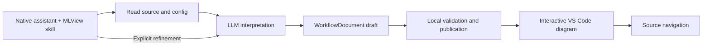

# MLView

[](https://github.com/realmyang/MLView/actions/workflows/ci.yml)
[](LICENSE)

**Use the LLM in your existing VS Code assistant to understand an ML workflow,
then explore its source-linked interactive diagram.** MLView provides a skill
for GitHub Copilot, Codex, and Claude Code, a common artifact format, and a
VS Code viewer. Your assistant reads the source and configuration, interprets
the workflow, and authors the diagram and findings.

MLView requires no separate model API key. The selected assistant supplies the
model, tools, permissions, and source-processing policy. Local helpers validate
citations and structure; the viewer displays the result. Neither helper nor
viewer executes the analyzed program. Citation validation does not prove the
model's interpretation correct.

This is an **experimental implementation**. See [implementation and validation
status](docs/STATUS.md) for what has actually been tested. Workflow interpretation
and findings come from the active assistant model.

## Get a diagram

The detailed install and refinement instructions are in
[LLM_WORKFLOW.md](docs/LLM_WORKFLOW.md). From this checkout, with Python 3.10+
and Node 20.18.1+:

```sh
cd webview && npm ci && npm run build && cd ..
python3 tools/sync-assets.py
cd vscode-extension && npm ci && npm run package && cd ..
python3 tools/install_skill.py /path/to/your/project
```

Install the generated VSIX using VS Code's **Extensions: Install from VSIX**.
The installer copies the self-contained skill into the target project's
`.agents/skills/mlview/` directory for Codex and Copilot. For Claude Code, use
the [Claude plugin](claude-plugin/README.md) or the workspace install described
in the runbook. Only install one copy of the skill in each discovery path.

1. Open the target project in VS Code and invoke `mlview` in your assistant's
   skill picker (`$mlview` in Codex). Ask, for example:
   “Explain training with this config. Show data, model, losses, parameter
   updates, validation, and anything unresolved.”
2. The assistant publishes a `*.mlview.json` file. Run **MLView: Open Generated
   Diagram** and select it. Click a step, connection or finding to see its
   claim and quotes. Press Enter, double-click, or use an **Open** link to open
   the cited lines beside the diagram; focus stays in the diagram. Alt+Enter
   opens them and moves focus to the editor.
3. Ask the same assistant to refine the diagram. A valid new revision updates
   the panel; filtering and navigating the existing diagram do not call an LLM.

To refine a particular node, edge, or finding, select it and use **Refine →
Copy prompt**. Choose an intent or enter a specific question, then paste the
prompt into the same assistant. The header is one row: the title, the
assistant and revision, search, the severity toggles, **N not observed**,
**Review**, a **⋯** menu (legend, flow animation, fit, exports, shortcuts) and
**Refine…**.
In a narrow panel, such as beside your code, search, the revision and **Review** move
into the **⋯** menu, and a row that is still too full folds **N not
observed** into it too, so **Refine…** stays in view. The status bar counts steps and connections, shows the
coverage status with its limitations, and says whether the cited files are
unchanged (in muted text) or changed (with a warning).

Beside the diagram, the rail has four tabs: **About**, **Findings**,
**Selection** and **Outline**. A new revision opens on About: the question
that was asked, what the model says it traced, the coverage with its
limitations (listed once), the scope, the run configuration, the cited files
with their freshness, and who wrote it ("Model-authored; MLView checks
citations, not the interpretation"). Selection shows the selected claim
first: its phase, title and full detail, a short note when it is inferred or
unresolved, the findings on it with **What to change**, its numbered source
quotes with line numbers and **Open**, and what it comes from and feeds (for
a group: the findings inside it, its steps and the connections across its
edge). A click on the diagram or a search hit shows the claim in Selection; a
row chosen in the Findings list or the Outline keeps that list in place. A
matching quote only shows that the cited lines are unchanged since
publishing; whether they support the claim is for you to judge. **Challenge
this claim** prepares a focused refinement request. Selecting a finding
frames every step it cites. The Outline's textual relationships provide All,
Incoming, Outgoing and Unresolved views alongside the diagram. In a panel
narrower than about 1260 px the rail is a bottom sheet under the diagram: a
tab strip until you select something, then about half the height, with the
selected card kept in view above it; Escape collapses it.

To check a diagram claim by claim, press `r` (or **Review**). The review walk
starts on the claims marked inferred or unresolved, the header's **N not
observed** count, and can also walk the findings, every claim, or, after a
cited file changed, the claims citing it. Each step selects the claim, shows
it in Selection and, after a short pause, opens its cited lines beside the
diagram, highlighted, while the keyboard stays on the diagram: `j` / `k` (or
↓ / ↑) move, `[` / `]` change quote, Enter opens again and Escape ends the
walk. A quote whose file changed is not opened; the walk says why. The walk
remembers its place for each revision and records nothing else.

To see the whole workflow at once, press Shift+0 (or **Phase overview** in the
**⋯** menu). The overview shows each phase as a block of its step titles, with
inferred and unresolved marks and the F labels of findings. Arrows count the
connections from one phase to the next, and brackets count those that skip
ahead or go back. Arrow keys and Enter (or a click) go to a phase; Escape
returns you to where you were. The phase index in the diagram's lower right
corner lists every phase with its findings and step count and marks the ones
in view. Beside the code it shrinks to one line such as "4/6 Objective,
optimizer & scheduler".

The workflow supports custom phases, nested groups, branches and cycles,
notebook cell references, and findings with evidence and counter-evidence.
Observed, inferred, and unresolved claims remain distinguishable: only the
inferred (dashed, with an `inferred` tag) and unresolved (dotted, with a
`? unresolved` tag) ones are marked on the diagram, and the header's
**N not observed** toggle fades the rest. Each phase is coloured by its place
in the document; colour is otherwise used only for problems. Finding badges
read F1, F2… in document order; the Selection tab and Refine prompts keep the
real finding id. The diagram opens at a zoom where cards can be read: the
whole document when it fits at 62% or more, otherwise the first phase at 90%.
Press `0` to return to that view, or use **Fit the whole diagram** in the
**⋯** menu to see everything; zoomed out, cards show just their titles at about 11 px. Saved source
edits mark the steps, connections, findings and quotes that cite the changed
files, and block jumps into those files; malformed updates retain the last
valid diagram. When the workspace root is a parent of the folder the diagram
cites from, the viewer says so and offers to add that folder to the workspace.

## How it works

Try the [native Codex-generated example](samples/configured_training.mlview.json)
from this repository's workspace. Its [validation log](docs/demo-logs/2026-09-16-llm-workflow.md)
records native model invocations, citation checks, live navigation/refinement
and remaining acceptance checks.


```mermaid
flowchart LR
    A[Native assistant + MLView skill] --> B[Read source and config]
    B --> C[LLM interpretation]
    C --> D[WorkflowDocument draft]
    D --> E[Local validation and publication]
    E --> F[Interactive VS Code diagram]
    F --> G[Source navigation]
    A -->|Explicit refinement| C
```

The portable skill is in [skills/mlview](skills/mlview/SKILL.md). The authoring
format is [WorkflowDocument 1.0](docs/WORKFLOW_CONTRACT.md), with its
[JSON Schema](contracts/workflow.schema.json). Generated JSON is data, never a script or an instruction to the viewer.

The dated 2026-09-18 [quality sprint](docs/QUALITY_SPRINT.md) records the skill
improvements and development follow-ups of that date. Its [review ledgers](evals/workflow/development/native-reviews/README.md)
cover twelve native artifacts and three no-skill baselines; their semantic
judgments remain provisional until human review.

The [trust and usability campaign](docs/TRUST_USABILITY_CAMPAIGN.md) adds evidence
review, validation scheduling, interpretation aids and reproducible performance
and candidate checks. It preserves WorkflowDocument 1.0; it does not establish
semantic accuracy or complete the human-reviewed pilot.

## Development

Use a Python 3.10+ virtual environment on PATH. The local macOS default may be
older. Component suites and the new skill checks run without an ML framework:

```sh
python -m pip install -r requirements-dev.txt
sh scripts/e2e.sh
```

The full check builds and tests the skill and viewer, validates evaluation
records, and inspects packaged skill ZIPs and the VSIX. On Windows use
`powershell -File scripts/e2e.ps1`.

See [CONTRIBUTING.md](CONTRIBUTING.md), [current status](docs/STATUS.md),
[security boundaries](SECURITY.md), and [the documentation index](docs/README.md).
The CI badge reports the default branch, main.
