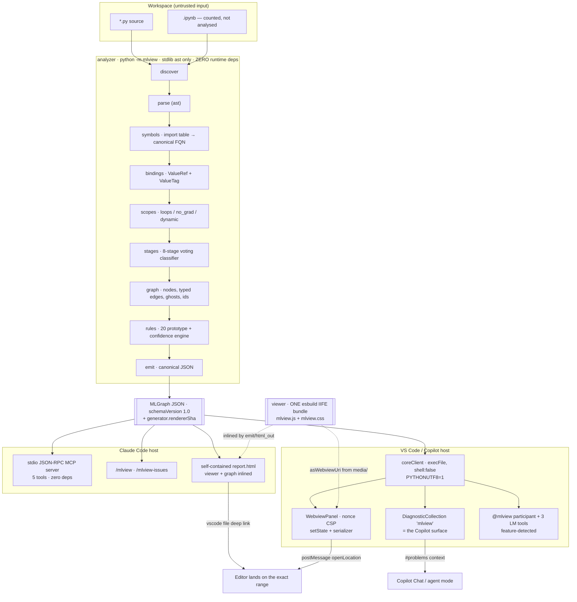

# MLView — Architecture

**Status:** frozen for the prototype build. Version 1.0, 2026-09-06.
Normative interfaces live in `CONTRACTS.md`; this document explains the shape, the reasoning, and the workflow.

---

## 1. The shape in one sentence

**One Python analyzer, one JavaScript renderer, two thin host adapters, joined by one versioned JSON document.**

Everything else in this design follows from refusing to let either host contain analysis logic or rendering logic of its own. Divergence between hosts is the classic failure mode of dual-host developer tools, and here it is prevented mechanically: both hosts invoke the same `python -m mlview` process, and both load a renderer bundle whose SHA-256 is asserted equal across all three copies and stamped into every graph document as `generator.rendererSha`.

---

## 2. Components

| Component | Language / runtime | Responsibility | Never does |
|---|---|---|---|
| **`analyzer`** (`mlview`) | Python 3.10+, **stdlib only** | Discover → parse → resolve → tag → classify → build graph → run rules → emit JSON / HTML / mermaid / text | Import user code. Touch the network. Know anything about VS Code or Claude Code. |
| **`viewer`** (`mlview-viewer`) | TypeScript → one esbuild IIFE | Layout, render, interact. Consumes an `MLGraph`, calls a `HostBridge` for anything host-specific | Parse Python. Compute severities. Know which host it is in, beyond the bridge it was handed. |
| **`vscode-extension`** | TypeScript, esbuild CJS | Spawn the analyzer, host the viewer in a webview, publish diagnostics, resolve the interpreter, register chat/LM surfaces | Analyse. Render. Duplicate any rule. |
| **`claude-plugin`** | Markdown + a stdlib Python MCP server | Slash commands, skills, the stdio JSON-RPC MCP server, the vendored core copy | Analyse. Render. |
| **`tools` / `scripts`** | Python + PowerShell | Sync assets/versions/core, verify parity, build, bench, run the e2e gate | — |

### 2.1 Analyzer internals (seven passes, each independently testable)

```
ingest/discover.py   walk, honour .mlviewignore + --include/--exclude, skip .venv/site-packages/
                     node_modules/build, cap at --max-files, count .ipynb as skipped
ingest/parse.py      ast.parse(src, filename); SyntaxError -> diagnostics[]; source text retained
                     so end_lineno/end_col_offset and snippets are exact
ir/symbols.py        per-module import table: `import torch.nn as nn` -> nn = torch.nn;
                     `from sklearn.preprocessing import StandardScaler as SS` -> SS = <fqn>.
                     Star-import marks the module dynamic. NO RULE MAY MATCH A BARE ATTRIBUTE
                     NAME — every rule matches canonical FQNs resolved here.
ir/bindings.py       flow-insensitive binding map: name -> ValueRef{originNodeId, tags, shapeHint}.
                     Handles tuple unpacking (train_test_split's positional convention), augmented
                     assignment, subscripting, self.x, and one level of module-local function
                     summaries (param_tags_in -> return_tags_out), fixed-point capped at 2 passes.
ir/scopes.py         Scope tree (Module/Class/Function/Loop/With/If). Records: loop kind
                     (epoch|batch|fold), what it iterates, insideNoGrad / insideAutocast /
                     insideEnableGrad, decorators, and `dynamic` (exec/eval/getattr-on-target/
                     star-import/**kwargs forwarding).
core/stages.py       8-stage classifier by priority-ordered voting: (1) knowledge-table FQN map,
                     (2) class-base evidence (nn.Module -> model), (3) dataflow context
                     (consumes a TRAIN_SPLIT value inside a loop over a LOADER -> train),
                     (4) enclosing-function name (weakest, tiebreak only).
                     Every vote is recorded in node.stageEvidence[].
core/graph.py        nodes, typed edges, 3-level hierarchy, ghost slots, content-addressed ids,
                     dedup, node cap + truncation
rules/               @rule-registered pure functions (GraphContext) -> Iterable[Issue];
                     confidence.py applies the six evidence factors
emit/                json_out (canonical), html_out (self-contained), mermaid_out, text_out
```

**Knowledge tables** (`knowledge/torch.yaml`, `sklearn.yaml`, `keras.yaml`, `hf.yaml`, `lightning.yaml`) map canonical FQN → `{stage, kind, role, framework, effects}`. Adding a framework is *data*, not code — and it can be reviewed by an ML engineer who does not read the analyzer's Python.

### 2.2 `ValueTag` — the substrate the leakage rules query

`RAW_DATA · FEATURES · TARGET · TRAIN_SPLIT · VAL_SPLIT · TEST_SPLIT · FITTED_TRANSFORMER · MODEL · LOADER · BATCH · LOGITS · PROBS · PREDS · LOSS · OPTIMIZER · DEVICE`

Tags propagate through assignment, tuple unpacking, arithmetic and known-signature calls. `argmax`/`round`/threshold clears `LOGITS`→`PREDS`. This is what lets the leakage family reason about *value identity* rather than about variable names. Name regexes are permitted only to **reinforce** a tag that dataflow already established — never to create one — and a regex-only match multiplies confidence by 0.8.

### 2.3 Confidence — six evidence factors

`confidence = clamp(rule.basePrior × Π factors, 0.05, 0.99)`

| Factor | 1.0 | de-rated |
|---|---|---|
| `fqn_resolved` | resolved through the import table to a known FQN | 0.75 attribute-shape only · 0.55 bare-name heuristic |
| `dataflow_direct` | producer→consumer in one function, no intervening redefinition | 0.85 crosses one function summary · 0.6 inferred from a parameter tag |
| `scope_static` | enclosing scope has no dynamic construct | 0.7 when `dynamic: true` |
| `context_confirmed` | the enclosing construct is confirmed (loop iterates a `LOADER`-tagged value) | 0.8 inferred from naming |
| `cross_file` | definition found inside the workspace | 0.9 assumed from a knowledge table |
| **`negation_absent`** | for absence rules: no plausible alternative provider anywhere in the workspace | **0.4** when Lightning / HF `Trainer` / `accelerate` / `ignite` / `fastai` / `Fabric` / DDP is detected |

Buckets: `certain ≥ 0.85 · likely ≥ 0.6 · possible ≥ 0.35 · speculative` below. The UI shows the **bucket**; the number is available in the JSON and the inspector, because hand-chosen priors do not deserve two decimal places of apparent authority.

**Absence-rule severity cap.** An absence-of-evidence rule (missing `zero_grad`, missing `model.eval()`, missing seed) may reach `high` **only** when the training loop resolved with no dynamic constructs **and** no framework wrapper is detected. Otherwise it is emitted at `medium` and confidence carries the emphasis. One wrong red marker on a senior engineer's correct code costs more than ten missed low-severity hints.

---

## 3. Data flow



**The two mechanical parity guarantees**, both cheap and both required on day zero:

1. **One analyzer** — `tools/verify.py` obtains the graph via the CLI *and* via scripted MCP frames, then byte-diffs after stripping `generatedAt` and `durationMs`.
2. **One renderer** — `tools/sync-assets.py --check` asserts SHA-256 equality across `webview/dist/`, `vscode-extension/media/` and `analyzer/src/mlview/emit/assets/`, and the same hash is stamped into every document as `generator.rendererSha`, so a drifted viewer is detectable from the data alone.

---

## 4. Tech choices and rationale

| Decision | Choice | Why | Rejected |
|---|---|---|---|
| Analyzer language | **Python 3.10+, stdlib `ast`** | Only parser guaranteed to agree with the target language across versions (walrus, `match`, PEP 695, nested f-strings). Zero install risk; works with torch absent, as on this machine. Exact `lineno`/`col_offset`/`end_*`. | `libcst`/`tree-sitter` (extra deps, weaker semantics); importing user modules (that *is* execution) |
| Core dependencies | **None at runtime** | Removes the whole class of pip/offline/version failures. `jsonschema` and `pytest` are dev-only, with a 60-line fallback validator if `jsonschema` cannot be installed. | pydantic (present here, absent elsewhere; schema is hand-authored and checked by test instead) |
| Layout | **`@dagrejs/dagre` 3.1.1 (MIT), applied per lane** | Verified maintained (3.1.1, modified 2026-08-08), synchronous, deterministic under a stable insertion order, tiny once bundled. Applying it *inside each fixed stage lane* gets proven layered ranking and crossing reduction while eliminating cross-group edge-lifting and back-edge machinery — the riskiest component anyone proposed. | `elkjs` (1.6 MB, async, worker, EPL/GPL); d3-force (non-deterministic → breaks snapshots and screenshots); hand-rolled layering (visible crossings at 40+ nodes, and requirement 4 is judged on exactly that) |
| dagre compound mode | **Not used.** `compound: true` + `setParent` is explicitly unverified. Groups are laid out children-first and inserted as a sized meta-node. | Never build containment on an unverified API in a one-session build. | — |
| Renderer stack | **Vanilla TypeScript. HTML node cards absolutely positioned over an SVG edge layer.** | HTML cards give real `tabindex`, `aria-label`, text ellipsis and CSS-variable theming for free — things `foreignObject` makes painful. SVG below handles curves and markers. | React + `@xyflow/react` (best UX-per-hour, but drags React + zustand + two Vite modes + `vite-plugin-singlefile` into a one-session build, makes the < 2 MB self-contained target doubtful, and leaves an unresolved attribution question) |
| DOM construction | **`document.createElementNS` / `textContent` only. `innerHTML` is banned by lint.** | The strict webview CSP then needs no `unsafe-inline` for scripts, and untrusted file paths and code snippets from an arbitrary repo cannot inject. | template strings + `innerHTML` |
| Bundling | **esbuild** — `--bundle --format=iife --global-name=MLView --platform=browser --target=es2020 --minify` for the viewer; the official VS Code CJS recipe (`platform:'node'`, `external:['vscode']`) for the extension | One self-contained script with dagre inlined; no CDN; satisfies the webview CSP via `<script nonce>`; also string-injectable into the standalone HTML. Sub-second builds, one dev dependency. | Vite ×2 modes, webpack, ESM (import maps fight the webview CSP) |
| Pinned versions | `esbuild@0.28.2`, `typescript@5.9.3`, `@types/vscode@1.100.0`, `@dagrejs/dagre@3.1.1` | npm `latest` for typescript is 7.0.2 — an unpinned `npm i -D typescript` would drop a major-version compiler into the build. | floating `latest` |
| `engines.vscode` | **`^1.100.0`** | The verified floor for a manifest carrying both `chatParticipants` and `languageModelTools` (the official chat-sample's value). The machine runs 1.136, so it is satisfied, and 1.100 does not needlessly exclude other machines. | `^1.90.0` (verified missing `registerTool`/`LanguageModelToolResult`/`LanguageModelTextPart`); `^1.95.0` (below the floor); `^1.136.0` (needlessly narrow) |
| MCP server | **Hand-rolled ~180-line stdlib stdio JSON-RPC 2.0.** Optional `--sdk` adapter behind a guarded import. | Verified landmine: the MCP Python SDK v2 renamed `FastMCP` → `MCPServer` and **deleted** `mcp.server.fastmcp` with no compatibility shim; `mcp` is not installed here; an autonomous agent's muscle memory produces the v1 import and a `ModuleNotFoundError`. Newline-delimited JSON-RPC over `initialize` / `notifications/initialized` / `tools/list` / `tools/call` / `ping` is small, testable by piping frames, and immune to SDK churn. | `pip install mcp` and code against remembered FastMCP |
| Webview persistence | **`getState`/`setState` + `WebviewPanelSerializer`. No `retainContextWhenHidden`.** | Verified guidance: `retainContextWhenHidden` "has high memory overhead and should only be used when other persistence techniques will not work", and `setState` is recommended for exactly this pan/zoom case. Content-addressed node ids make selection survive re-analysis. | `retainContextWhenHidden: true` |
| Host↔core transport | **Spawn a child process per analysis** | No long-lived daemon to leak or wedge; cancellation is `child.kill()`; no ports, no Windows firewall prompt. | A persistent socket server |
| Copilot integration | **`DiagnosticCollection` is the headline deliverable.** Chat participant + LM tools are additive, feature-detected, compile-verified. | Copilot Chat's `#problems` context, inline fix and agent mode all read the Problems panel — so a diagnostic collection delivers Copilot support with zero Copilot API surface and no Copilot install. Verified guidance also recommends *not* taking an `extensionDependency` on Copilot. Copilot is absent here, so nothing else can be exercised live. | Claiming verified Copilot support |
| Diagnostic severity | **high → `Warning` by default**, `mlview.diagnosticSeverity` escalates to `Error` | Third-party `Error`s in the Problems panel read as build failures and can gate workflows. Requirement 3 is unaffected: the red marker lives on the diagram, which is where the spec asks for it. | high → Error by default |
| Packaging today | **F5 Extension Development Host** | Fewest moving parts for the demo. Note the correction: `@vscode/vsce` declares `engines.node >= 20`, and this machine has 20.9, so `npx @vscode/vsce package --no-dependencies` *would* work — it is simply not on the critical path. | Encoding a false "Node 22 required" constraint |

---

## 5. Directory layout and ownership

Exactly one agent owns each top-level directory. **No agent edits another agent's directory**; a needed change to someone else's contract is *reported, not made*.

```
MLView/
  project.md
  README.md
  docs/                                REQUIREMENTS · ARCHITECTURE · ISSUE_RULES · UX_DESIGN · CONTRACTS
  contracts/                           FROZEN, read-only after T+10min
    graph.schema.json                  JSON Schema 2020-12, schemaVersion 1.0
    graph.sample.json                  hand-authored golden graph — unblocks viewer + hosts at T+0
    cli.md  messages.md  mcp.md  rule_api.md  renderer_api.md  core_api.md
  analyzer/                            [A1 core] + [A2 rules]
    pyproject.toml                     name=mlview, requires-python>=3.10, zero runtime deps
    src/mlview/
      __main__.py  cli.py  version.py  api.py         # A1 — api.py is the frozen in-process entry
      ingest/ discover.py  parse.py                   # A1
      ir/     symbols.py  bindings.py  scopes.py  values.py   # A1
      core/   stages.py  graph.py  ids.py  locate.py  collapse.py  ghosts.py  # A1
      knowledge/ torch.yaml sklearn.yaml keras.yaml hf.yaml lightning.yaml   # A1 seeds, A2 extends
      rules/  registry.py  confidence.py  suppress.py                        # A2
              r_leakage.py r_trainloop.py r_eval.py r_loss.py
              r_model.py r_device.py r_repro.py r_data.py                    # A2
      emit/   json_out.py  html_out.py  mermaid_out.py  text_out.py
              assets/{mlview.js,mlview.css}            # written by tools/sync-assets.py
      schema/ graph.schema.json                        # mirror of contracts/, test-asserted equal
    tests/  core/ [A1]   rules/ [A2]   clean/ [A2]   fixtures/ [A2]   golden/ [A1]
  webview/                             [A3 viewer]
    src/ main.ts types.ts layout.ts render.ts nodes.ts edges.ts markers.ts
         interact.ts inspector.ts rail.ts palette.ts states.ts a11y.ts bridge.ts
         styles/{tokens.css,base.css,nodes.css,edges.css,panels.css,lod.css}
    dev/ index.html states.html        # dev harness loads contracts/graph.sample.json
    dist/ mlview.js mlview.css         # committed placeholder on day 0 so every build path works
    test/ layout.test.ts glyphs.test.ts contrast.test.ts states.test.ts parity.test.ts
    build.mjs  package.json
  vscode-extension/                    [A4 vscode]
    package.json tsconfig.json esbuild.mjs .vscodeignore
    src/ extension.ts pythonEnv.ts coreClient.ts panel.ts diagnostics.ts
         revealInDiagram.ts locationIndex.ts chat.ts lmTools.ts protocol.ts log.ts
    media/                             # synced viewer bundle + icons
    docs/rules/MLVxxx.md               # offline rule docs, generated from the registry
    test/ lmtool.smoke.js protocol.test.js
  claude-plugin/                       [A5 hosts+glue]
    .claude-plugin/plugin.json
    .mcp.json
    commands/mlview.md  commands/mlview-issues.md
    skills/mlview-visualize/SKILL.md  skills/mlview-triage/SKILL.md
    server/mlview_mcp.py               # zero-dep stdio JSON-RPC
    vendor/mlview/                     # synced copy of the core → no pip install needed
  samples/                             [A5]
    vision_pipeline/        {config.py, data.py, model.py, train.py, sklearn_baseline.py,
                             expected_issues.json}
    vision_pipeline_clean/  same files, correct
  tools/                               [A5]
    sync-assets.py  sync-core.py  sync-version.py  verify.py  bench.py
  scripts/                             [A5]
    build.ps1  e2e.ps1  demo.ps1
  .claude-plugin/marketplace.json      [A5] — repo doubles as a local marketplace
  out/                                 gitignored
```

**Shared files and their single owners:** `contracts/graph.schema.json` (A1), `contracts/messages.md` (A4), `contracts/renderer_api.md` (A3), `contracts/mcp.md` (A5), `contracts/rule_api.md` + `core_api.md` (A1). All are frozen once published.

**The parallelization unlock.** A1's *first* deliverable, inside the first ten minutes and before any real analysis exists, is `contracts/graph.schema.json` + a hand-authored `contracts/graph.sample.json` + `python -m mlview analyze --demo` returning that golden graph. From that moment A3, A4 and A5 have real data to build and test against and never block on the analyzer. `webview/dist/mlview.js` ships as a committed placeholder on day 0, so `scripts/build.ps1` and every host path work before any `npm install` completes.

---

## 6. How the single core serves both hosts

### 6.1 The three seams, all frozen

1. **Process seam — the CLI.** `python -m mlview analyze <path> --json -`. stdout carries *only* the JSON; every log, warning and progress line goes to stderr; exit codes are `0 ok · 1 usage/IO · 2 --fail-on exceeded · 3 internal · 4 nothing analyzable`. Both hosts call exactly this. (`CONTRACTS.md` §3.)
2. **In-process seam — `mlview.api`.** `analyze(paths, options) -> MLGraph` and `analyze_to_dict(...) -> dict`. The MCP server imports this rather than shelling out to itself, so MCP and CLI cannot diverge in argument handling; `verify.py` proves the outputs match anyway.
3. **Render seam — `window.MLView.mount(el, graph, bridge) -> MLViewApp`.** The only host-specific code in the viewer is the `HostBridge` (7 methods). `VsCodeBridge` speaks `postMessage`; `StandaloneBridge` navigates a `vscode://file` URI and falls back to clipboard + toast.

### 6.2 Claude Code path

- `.claude-plugin/plugin.json` (only this file lives inside `.claude-plugin/`; `commands/`, `skills/`, `.mcp.json` stay at the plugin root, which are the default scan locations — so `plugin.json` **omits** the component-path override fields entirely).
- `.mcp.json` at the plugin root, in the verified Windows-safe form: `type: "stdio"`, `command: "python"`, `args: ["${CLAUDE_PLUGIN_ROOT}/server/mlview_mcp.py"]`, `env: { PYTHONPATH: "${CLAUDE_PLUGIN_ROOT}/vendor", PYTHONUTF8: "1", PYTHONIOENCODING: "utf-8" }`.
- **`vendor/mlview` is a synced copy of the core**, put on `PYTHONPATH`, so the Claude Code path needs no `pip install` at all. `tools/sync-core.py --check` guards the drift, and `verify.py` catches it semantically.
- **Graceful degradation:** if the MCP server fails to start, `/mlview` still works — the skill body shells out to `python -m mlview` through `Bash`. The demo does not depend on MCP registration succeeding.
- The visual surface in a terminal host is the **self-contained HTML report**, opened with `os.startfile` on Windows, plus a mermaid and an ASCII lane view for cheap in-transcript reasoning.

### 6.3 VS Code / Copilot path

- `coreClient.ts` spawns with `shell: false`, an absolute interpreter path, `-X utf8`, and `PYTHONUTF8=1` / `PYTHONIOENCODING=utf-8`. stdout is accumulated (32 MB cap) and parsed; stderr streams to the `MLView` Output channel. Cancellation is `SIGTERM` then `SIGKILL` after 2 s; a single-flight queue keyed by scope collapses save-bursts; results are cached by content hash.
- `panel.ts` creates the webview with `enableScripts: true`, `localResourceRoots: [media]`, and the verified nonce CSP: `default-src 'none'; img-src ${cspSource} data:; style-src ${cspSource} 'unsafe-inline'; font-src ${cspSource}; script-src 'nonce-${nonce}';`. `'unsafe-inline'` is granted for **styles only** (nodes carry positional styles); scripts are nonce-locked and `default-src 'none'` is the CSP-level enforcement of the offline requirement.
- `diagnostics.ts` publishes the ≥ 0.6-confidence, unsuppressed issues. **This is the Copilot integration that works today.**
- `chat.ts` and `lmTools.ts` register only behind `typeof vscode.chat?.createChatParticipant === 'function'` and `typeof vscode.lm?.registerTool === 'function'`, each wrapped in try/catch, so a chat-API change can never break activation of the diagram, diagnostics and reveal. Every language-model tool contribution carries **both** `canBeReferencedInPrompt: true` **and** a `toolReferenceName` — without both, agent mode never calls it.

### 6.4 Interpreter resolution (the highest-probability silent failure on this machine)

Ordered, each candidate validated by `-c "import sys; print(sys.version_info[:2])"` requiring ≥ 3.10, then a handshake `-m mlview --version --json`:

1. `mlview.pythonPath` setting, if non-empty.
2. The `ms-python.python` extension API (`environments.getActiveEnvironmentPath()` → `resolveEnvironment()` → `executable.uri.fsPath`; the first may return a folder, so resolving is required), inside try/catch since the extension may be absent. Subscribe to `onDidChangeActiveEnvironment` and re-handshake.
3. `python.defaultInterpreterPath`.
4. PATH probe: `python`, `py -3`, `python3`.

On `ModuleNotFoundError` the notification offers **Install MLView core** (opens a Terminal running `pip install -e <repo>/analyzer`), **Select Interpreter**, **Show Output**. On a schema-major mismatch, a distinct message naming both versions. A status-bar item `$(graph) MLView` shows idle / analyzing / error and clicks through to the Output channel. The result is memoized.

---

## 7. Dev workflow

```powershell
# 0. one-time
py -3 -m pip install -e .\analyzer            # zero runtime deps; pytest + jsonschema for dev
cd webview           ; npm install            # esbuild@0.28.2, @dagrejs/dagre@3.1.1, typescript@5.9.3
cd ..\vscode-extension; npm install           # esbuild, typescript, @types/vscode@1.100.0, @types/node@20

# 1. build everything and sync the one renderer into all three homes
.\scripts\build.ps1

# 2. iterate
cd webview ; npm run dev                      # esbuild --watch; open dev/index.html against graph.sample.json
python -m mlview analyze samples\vision_pipeline --json - | python -m json.tool
python -m mlview analyze samples\vision_pipeline --html out\report.html --open

# 3. VS Code
code --extensionDevelopmentPath=<abs>\vscode-extension <abs>\samples
#   or F5 with .vscode/launch.json { "type": "extensionHost",
#      "args": ["--extensionDevelopmentPath=${workspaceFolder}/vscode-extension",
#               "${workspaceFolder}/samples"] }

# 4. Claude Code
claude plugin validate .\claude-plugin --strict
claude --plugin-dir <abs>\claude-plugin
#   /mcp  ->  mlview connected, 5 tools
#   /mlview samples/vision_pipeline

# 5. the gate
.\scripts\e2e.ps1
```

`scripts/build.ps1` is the **only** thing that writes `webview/dist` → `vscode-extension/media/` and `analyzer/src/mlview/emit/assets/`, and it records the bundle SHA-256 into `mlview/version.py` as `RENDERER_SHA`.

---

## 8. Packaging

| Artifact | How | Today |
|---|---|---|
| Analyzer | `pip install -e ./analyzer`, or vendored into the plugin by `tools/sync-core.py` | Both. The vendored copy is what makes the plugin installable with zero pip steps. |
| Viewer | esbuild IIFE → `webview/dist/mlview.js` + `.css`, synced to three homes | Yes |
| VS Code extension | esbuild CJS → `dist/extension.js`, `external: ['vscode']`; `.vscodeignore` excludes `src/`, `node_modules/`, `tsconfig.json` | **Run via `--extensionDevelopmentPath` / F5.** `npx @vscode/vsce package --no-dependencies` works on Node 20.9 (`engines.node >= 20`) but is off the critical path. |
| Claude Code plugin | `claude --plugin-dir <abs>` for the session; or the repo's root `.claude-plugin/marketplace.json` + `/plugin marketplace add ./` + `/plugin install mlview@mlview-local`; or MCP-only via `claude mcp add mlview -- python <abs>/claude-plugin/server/mlview_mcp.py` | `--plugin-dir` for the demo, with `claude plugin validate --strict` run first |
| Version identity | `tools/sync-version.py` propagates `mlview.version.__version__` into the extension's `package.json`, the plugin's `plugin.json` and the viewer's `package.json`; `--check` fails on drift | Yes |

---

## 9. Testing strategy

Nine layers. The two parity checks and the two precision gates are the ones that would be missed under time pressure and must not be.

1. **Pass-level unit tests** (`tests/core/`) — import-alias resolution (20+ cases including `as`, relative, re-export, star-import → `dynamic`), binding tracking, loop-kind classification, `insideNoGrad` propagation through `with`/decorators with `enable_grad` negation, stage voting (a ~60-row FQN → stage table), confidence factor arithmetic and bucket boundaries.
2. **Rule tests** (`tests/rules/`) — every code has `<CODE>_bad.py` and `<CODE>_good.py`. Fixtures are **self-describing**: `# MLVIEW-EXPECT: MLV201 line=44 confidence>=0.6` is parsed by the harness, so the expectation cannot drift from the fixture. The negative fixture is the important half — every named false-positive guard in `ISSUE_RULES.md` becomes a concrete `_good.py`.
3. **Precision gates** — `test_precision.py` (clean-reference corpus: ≥ 6 idiomatic correct programs including a Lightning module and a HF `Trainer` script; **0 high, ≤ 2 medium**) and `test_no_cross_fire.py` (the union of every `_good.py` yields **0** issues, catching rules that fire on each other's clean code). Complementary: one catches framework-indirection FPs, the other catches rule cross-talk. Both are hard CI failures.
4. **Meta-tests** — `test_registry_complete.py`: every registered code has both fixtures, a `fixHint`, a severity, a `ruleVersion` and a docs page; every fixture maps to a registered code. This is what keeps five parallel agents honest without review.
5. **Golden snapshots** (`tests/golden/`) — canonicalized graphs for ~15 fixtures, with `generatedAt`/`durationMs`/`absFile` normalized out. A one-line knowledge-table edit that silently rewires ten edges shows as a ten-line diff instead of a green build. `pytest --snapshot-update` regenerates.
6. **Invariant tests** — `test_no_exec.py`, `test_determinism.py`, `test_locations.py` (re-open every emitted loc and assert the symbol appears in the slice — this one test catches the classic 1-based-line / 0-based-col off-by-one across nodes, edges and issues at once), `test_node_id_stability.py` (insert 20 blank lines: ids unchanged, lines shifted by 20), `test_offline.py`, `test_digest_budget.py`, `test_stdout_purity.py` (grep for bare `print(` outside the text emitter), `test_schema_current.py` (the committed schema equals `python -m mlview schema`, and `analyzer/src/mlview/schema/` equals `contracts/`).
7. **Renderer tests** (node, jsdom where needed) — `layout.test.ts` (deterministic to 1e-6; no sibling overlap; every child inside its lane; back-edges routed outside their loop box; 300 nodes < 300 ms), `glyphs.test.ts` (the three severity `path` `d` values differ structurally), `contrast.test.ts` (every declared token pair, light/dark/HC, ≥ 4.5 text / ≥ 3.0 graphics), `states.test.ts`, and `parity.test.ts` (load one golden graph through `VsCodeBridge` and `StandaloneBridge` and assert identical `data-node-id` / `data-severity` sets).
8. **Host tests** — `npx tsc --noEmit` on the extension is genuinely load-bearing: it is what proves the chat-participant and language-model-tool code compiles against the real `@types/vscode` surface with Copilot absent. Plus pure-function tests for `protocol.ts` (round-trip, unknown-message tolerance), the loc → `vscode.Range` boundary conversion, the workspace-containment guard, the digest budget, and the CSP/HTML builder. `node test/lmtool.smoke.js` invokes the exported tool handler directly — the best available substitute for the untestable Copilot path. `tests/test_mcp.py` pipes `initialize` / `notifications/initialized` / `tools/list` / `tools/call` frames over a pipe and validates the responses, with Claude Code not running.
9. **End-to-end** — `scripts/e2e.ps1` runs `tools/verify.py` (CLI-vs-MCP byte-diff), the SHA-256 triple-equality, the offline HTML grep, the expected-issue-count assertions on the dirty and clean samples, the `--fail-on` exit code, `claude plugin validate --strict`, `pytest -q`, the node tests and `tsc --noEmit`, then prints a single PASS/FAIL summary an autonomous agent can act on without reading logs.

Coverage target: `--cov=mlview --cov-fail-under=80`, with `rules/` held to 95 % (rules are small and pure; anything uncovered there is a rule with no test, which the registry meta-test should already have caught).

---

## 10. Risks and mitigations

| # | Risk | Impact | Mitigation | Residual |
|---|---|---|---|---|
| **1** | **False positives destroy trust faster than false negatives build it.** One wrong red octagon on a senior engineer's correct code and the tool is uninstalled. | Fatal to adoption | Precision is a test, not an aspiration: the clean-reference corpus gate (0 high), `test_no_cross_fire`, a negative fixture for every named FP guard, confidence gating at 0.6 for the Problems panel, the absence-rule severity cap, and per-rule suppression from day one. | Rules keyed partly on naming can still misfire on unusual code; those are capped at `medium` and phrased as questions. |
| **2** | **Framework indirection.** Lightning / HF `Trainer` / `accelerate` / `fastai` / `ignite` hide the whole training loop inside library code we cannot read; roughly half the train-loop rules are inapplicable there. | Alarms on exactly the most modern codebases | The `negation_absent` gate suppresses those rules and says so **visibly** ("training loop handled by Lightning — 7 rules not applicable"), rather than firing or silently skipping. Lightning and HF scripts are in the clean corpus, so the gate is exercised by CI. | MLView looks quiet on those repos — mitigated by the explanatory chip. |
| **3** | **Config-driven / dynamic code produces a thin graph.** `getattr(models, cfg.name)()`, registries, `**kwargs` forwarding are common in research repos. | Credibility cliff on first contact with a real repo | Never drop an unresolved call: emit a dashed `unknown` node, mark the enclosing scope `dynamic`, multiply confidence by 0.7, and show a "partial understanding" banner. The empty state lists the top unresolved imports, which doubles as a coverage bug report. | A sparse real-world graph still contrasts with a beautiful demo — honesty markers are the defence, not a fix. |
| **4** | **Cross-file resolution is where a demo becomes a product.** Real repos split data / model / train across files, and fit-before-split leakage most often straddles a preprocessing module and a training script. | The graph fragments on real code | Workspace-level definition lookup and one level of module-local function summaries are P1, not deferred; `fixtures/multifile/` is a required acceptance fixture. | Deep interprocedural dataflow is out of scope; some leakage across a helper will be missed. |
| **5** | **Layout quality is what requirement 4 is judged on**, and it is the hardest thing to get right in one session. | "A box diagram", not a beautiful one | Constrain the problem: eight fixed lanes remove most general-layout difficulty; dagre handles ranking and crossing reduction *inside* each lane; node boxes are always laid out at full-detail size so LOD never reflows; layout is snapshot-tested; the no-overlap and containment assertions are written before the renderer. | Dense real-world graphs will look worse than the demo. Auto-collapse above 120 nodes keeps first paint at ~25 boxes. |
| **6** | **Five parallel agents produce five components that do not compose.** | Nothing renders at 5pm | Contract-first: `graph.schema.json`, `graph.sample.json` and `analyze --demo` land at T+10min and are frozen; one directory per agent with zero shared files; a committed placeholder `dist/mlview.js`; contract changes are *requested*, not made; `verify.py` catches divergence mechanically rather than at integration time. | A frozen contract that turns out wrong requires a coordinated change. |
| **7** | **Python spawning on Windows** — conda paths, spaces, the Microsoft Store `python` stub, cp1252, antivirus latency. Failure mode is "the diagram is empty", the worst kind. | Silent failure | Four-step interpreter chain with a version handshake; `shell: false` + absolute path; `PYTHONUTF8`/`PYTHONIOENCODING`/`-X utf8` everywhere including `.mcp.json`; an Output channel showing the exact argv and stderr; an actionable notification with **Select Interpreter** / **Install MLView core**; a designed hard-error state instead of a blank canvas. | A first-run failure on an unusual environment still costs the user a minute. |
| **8** | **Copilot cannot be verified here.** Copilot is not installed, so the chat participant and LM tools are compile-only. | An API-shape mismatch discovered on someone else's machine | `engines.vscode: ^1.100.0` and `@types/vscode@1.100.0`; `tsc --noEmit` as a hard gate; every registration behind a `typeof` guard inside try/catch so absence degrades to "feature not present" and never breaks activation; the tool bodies extracted into pure functions and exercised by a node smoke test; the Problems-panel path carries the actual requirement. The README states the limitation instead of claiming verified support. | Registration-time contract errors (e.g. a name mismatch between `package.json` and `registerTool`) surface only with Copilot present. |
| **9** | **MCP SDK churn.** `mcp.server.fastmcp` is gone; `FastMCP` → `MCPServer`; `mcp` is not installed here. | `ModuleNotFoundError` mid-session | Hand-rolled stdlib server as primary; the SDK adapter behind `--sdk` and a guarded import; `tests/test_mcp.py` drives the server over pipes with zero third-party deps. | We own protocol-version compatibility. The server echoes back the client's `protocolVersion`, defaulting to `2025-06-18`. |
| **10** | **A stray `print()` corrupts a JSON-RPC frame or the JSON on stdout.** Looks like "the tool is broken", not "line 40 has a debug print". | Confusing, expensive failure | Hard convention (stdout = payload only); `test_stdout_purity.py` greps the core; the extension's JSON-parse error path surfaces the raw stdout head in the Output channel. | — |
| **11** | **XSS via analysed source.** File paths, identifiers and code snippets from an untrusted repo land in the report and the webview. | Real vector | `innerHTML` banned by lint; DOM built with `createElementNS`/`textContent`; the HTML emitter escapes every interpolation; asserted by test. | — |
| **12** | **Scope.** 20 rules + full analyzer + renderer + MCP + extension + plugin is a lot of surface. | Everything at 80 % rather than the core at 100 % | Strict P0/P1/P2 ordering; the demo walkthrough *is* the definition of done; a 12-rule demo-critical subset is flagged in `ISSUE_RULES.md` so the demo survives a slip; the OUT list is a commitment; a mid-session checkpoint falls back to line-order-plus-binding leakage analysis if the value-tag pass slips. | Fewer rules than hoped — an acceptable failure mode, unlike "nothing renders". |
| **13** | **The viewer bundle is on the critical path for both hosts.** If A3 slips, both the report and the webview are empty. | Blocking | A3's first deliverable is a deliberately plain but *functional* bundle (boxes, lines, clicks, badges) within the first third of the budget; polish is layered on and every later commit keeps the bundle shippable. A committed placeholder covers T+0. | — |
| **14** | **Token blowout in the AI surfaces.** An unbounded `mlview_analyze` result on a real repo makes the plugin unpleasant and crowds out the user's task. | Adoption | A hard ≤ 4 KB digest budget on every model-facing result, enforced by a test on a 500-node synthetic graph, with full detail behind `graphPath` and `mlview_explain`. | — |
| **15** | **Panel/webview lifecycle bugs** — a stale graph after a workspace-folder change, diagnostics for deleted files, `postMessage` to a disposed panel. | Feels unreliable even when the analysis is perfect | Every disposable in `ctx.subscriptions`; explicit `diags.clear()` on workspace change and per-file clearing when a file drops to zero issues; a disposed-guard on every `postMessage`; a serializer so a reload restores rather than orphans the panel. | — |
