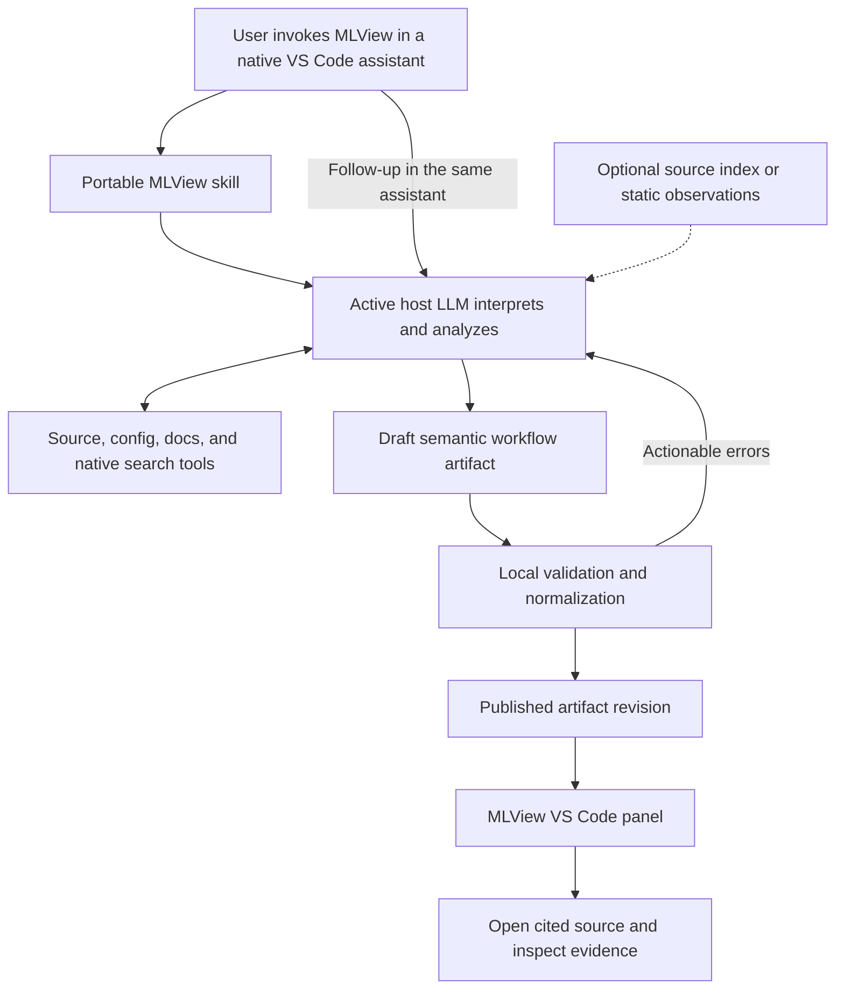

# MLView: plan for an LLM analysis backend

**Date:** 2026-09-16. **Status:** approved by the user's subsequent instruction
“Execute your recommended plan.” This document preserves the design proposal;
[LLM_IMPLEMENTATION.md](LLM_IMPLEMENTATION.md) records implementation and tests.
It supersedes the static-analyzer expansion roadmap as the active direction.

## 1. Product intent and decision

**MLView should be a reusable skill that makes the user's active assistant
understand ML/DL code and produce an interactive, source-linked diagram.**
The model running in GitHub Copilot, Codex, or Claude Code inside VS Code owns
interpretation, analysis, abstraction, and findings. MLView provides the skill,
an artifact format, reliable supporting utilities, and the visual interface.

The user selected this first-release interaction:

> Invoke an MLView skill in whichever assistant I already use, then open the
> interactive diagram.

Use the host's existing session, model selection, authentication, tools, and
permission controls. MLView should require no separate model API key or model
service. Host usage limits and processing policies still apply. The Sol-only
rule in [AGENTS.md](../AGENTS.md) governs development subagents here; the shipped
workflow does not need to spawn subagents or impose Sol on the user's assistant.

The original [project.md](../project.md) asked for interactive ML workflow
visualization and issue markers. The restrictive decisions came later:
[REQUIREMENTS.md](REQUIREMENTS.md) added static-only analysis, offline analysis,
byte-deterministic interpretation, and an exclusion of LLM analysis. The existing
[Claude skill](../claude-plugin/skills/mlview-visualize/SKILL.md) even directs the
model to obtain static analysis before reading code and discourages independent
exploration. These choices describe the existing implementation; they must not
govern the new product.

**Recommended architecture:** a portable skill in the native agent session,
writing a compact semantic artifact, with a shared VS Code renderer. Pause
the research review's Sprint A as the default next campaign. Reuse useful
existing components without making the static rule catalog a prerequisite for
the new analysis path.

## 2. What a successful session looks like

Example request: “Use MLView to explain this repository's training and
evaluation workflow. Show how the dataset, model, loss, and metrics connect.”

1. The skill uses the native agent's file/search tools to discover likely
   entrypoints, configuration, and important implementation files.
2. The LLM traces the selected workflow across those files, decides the right
   abstraction, identifies meaningful dependencies, and records uncertainty.
3. It writes a structured diagram with source evidence. A helper validates it;
   the LLM repairs specific errors if needed.
4. The user opens **MLView: Open Generated Diagram** in VS Code. The panel shows
   a readable overview with expandable detail, flow animation, and issue markers.
5. Clicking a step or connection opens the evidence in the editor. A step may
   have several source locations, including configuration and implementation.
6. In the same assistant, the user asks “expand the teacher/student losses,”
   “show only inference,” or “this experiment uses the other YAML config.” The
   LLM updates the interpretation; the panel refreshes from the new revision.

The first release should handle Python ML/DL plus relevant notebooks, YAML,
JSON, TOML, launch scripts, and documentation. These are validation priorities,
not a Python-AST gate on what the model may read. Other languages can be
represented when the host understands them; broad support claims require tests.

Default to semantic steps a reader recognizes: “augment training images,”
“compute teacher targets,” “update student,” “select checkpoint.” Expand into
functions and calls on demand. Preserve branches, repeated phases, nested loops,
shared components, and multiple pipelines. Eight lifecycle stage names may be
one presentation preset; the representation must permit custom/repeated phases.

## 3. Host feasibility and installation

The research below checks documented capabilities, not a completed live MLView
integration. These mechanisms still need the live spike in milestone M1.

| Host in VS Code | Documented entry point | Proposed MLView path |
|---|---|---|
| GitHub Copilot agent | Agent Skills with `SKILL.md`, slash invocation, and repository skill discovery including `.agents/skills/`. [VS Code skills](https://code.visualstudio.com/docs/agent-customization/agent-skills) | Invoke `/mlview`; native agent reads code and writes the artifact. |
| Codex IDE extension | Standalone skills are supported in the IDE; repository discovery uses `.agents/skills/`. Explicit `$mlview` invocation is available. [OpenAI skills](https://learn.chatgpt.com/docs/build-skills) | Invoke `$mlview`; native Codex session performs the analysis and writes the same artifact. |
| Native Claude Code extension | Claude skills support personal/project locations and plugin distribution; plugin commands are namespaced. [Claude skills](https://code.claude.com/docs/en/skills) | Generate a Claude plugin skill from the same source; use a namespaced command such as `/mlview:visualize`. |

Keep one authored skill under a proposed `skills/mlview/` package directory,
with common `name`/`description` metadata and relative references. Use thin,
reviewed host adapters; automate distribution generation once the live spike
establishes the packaging differences. Avoid host-specific shell interpolation, injected
commands, or mandatory subagent frontmatter in the common instructions.

For the development/install path, `.agents/skills/mlview/` can serve Codex and
Copilot; the existing Claude plugin packaging can carry the Claude adapter.
Do not install a second same-name `.claude/skills/mlview/` beside it blindly:
Copilot discovers both directories, and its current documentation does not
establish collision precedence. Check simultaneous installation explicitly.
The actual skill command must be shown in each host's install instructions.
Consumers install the skill and viewer for their own repositories; cloning
MLView's development repository must not be required for normal use.

**The common integration is a file, not access to another extension's model.**
The skill writes a versioned workspace artifact. The MLView extension opens it
and refreshes after valid updates. A later Copilot tool may publish/open it
directly, but that is an optional convenience. VS Code extension tools can use
editor APIs; MCP tools run outside the extension and cannot directly use those
APIs. [VS Code extensibility](https://code.visualstudio.com/api/extension-guides/ai/ai-extensibility-overview)

The VS Code Language Model API exposes available registered models, with model
selection and consent constraints. It does not establish that MLView can borrow
the native Codex or Claude Code session. A Claude-family model selected inside
Copilot is also different from using the native Claude Code agent. Consequently,
a universal provider-selector panel is outside the first release.
[VS Code Language Model API](https://code.visualstudio.com/api/extension-guides/ai/language-model)

Local MCP can later expose the same deterministic helpers if it improves
ergonomics. Codex supports local STDIO MCP with shared CLI/IDE configuration.
[OpenAI MCP](https://learn.chatgpt.com/docs/extend/mcp?surface=cli)
MCP sampling, headless assistant SDKs, cloud agents, subscription-token access,
and custom model endpoints are unnecessary for the chosen first-release flow.

## 4. Responsibility boundary

| LLM owns | Local code owns |
|---|---|
| Which entrypoints and config variants matter | Inventory, bounded source reads, hashes and paths |
| Meaning of operations and domain-specific stages | Schema, references, size limits and source-range checks |
| Cross-file/config interpretation and alternative flows | Stable serialization, revision management and layout |
| Appropriate grouping, detail, and explanations | Source navigation, interaction and exports |
| Potential issues, counter-evidence, and open questions | Recording provenance and structural validation status |

A valid artifact can contain semantic mistakes. File/range/hash checks prove
that evidence exists, not that it entails the model's claim. The interface and
tests must preserve that distinction. A helper must not invent semantics to
fill a missing field, require a known framework, or reject a new relationship
because the static analyzer cannot recognize it.

## 5. The skill's analysis workflow

### Discover a concrete execution scenario

Inspect a compact tree, package metadata, launch commands, READMEs, notebooks,
configs, and selected source. Identify entrypoints through their use, not only
filenames. Follow custom factories, framework lifecycle hooks, registry code,
and config references. Read configs as data; do not launch training or import
the target project merely to understand it.

For “map the repository,” show the discovered workflows and their shared parts.
For a specific training command or config, trace that scenario. If the choice
materially changes the result, present candidate scenarios or ask one focused
question. Do not merge mutually exclusive experiments into one apparent run.

### Gather evidence while building the explanation

Follow imports, callers, object construction, data transformations, optimization,
evaluation, and output artifacts. Use native search/read first. A small helper
can return numbered excerpts and stable evidence references; an AST symbol
index is optional acceleration, not the semantic oracle. Configs and notebook
cells need equivalent anchors. Missing runtime values remain parameters or
alternatives, rather than invented constants.

Retain concise source-backed notes as the analysis proceeds, so a context
compaction or interruption does not lose the graph's basis. Distinguish source
behavior from documentation intent and from observed test results. Reading a
test is not executing it. Reading a notebook does not establish execution order.

### Synthesize the diagram and review its interpretation

Build overview, pipeline, and implementation levels. Separate data movement,
control, configuration, optimization, and artifact dependencies where relevant.
Distinguish inference from training and forward computation from parameter
updates. Connections can cite multiple locations across files.

For review requests, inspect the resulting workflow for problems beyond the
36 existing rules: config contradictions, incorrect branch selection, mismatch
between objectives and metrics, leakage, state management, and domain-specific
risks. Search likely counter-evidence before making a strong accusation. A
claim that something is absent must say where the model looked. “Not inspected”
must never become “missing.” Pure mapping requests need not trigger an exhaustive
defect audit; obvious material risks can still be marked.

Publish when the requested scenario is answered, material entrypoint/config
alternatives are traced or explicitly unresolved, displayed claims have evidence
or clear qualifications, and significant uninspected areas are named. Stop when
that goal is met. If context/time/host limits intervene first, publish a partial
revision and state what remains; a plausible first sketch is not completeness.

Perform a bounded critique pass before publishing: check alternative meanings,
unsupported edges, claimed absences, and whether the graph answers the request.
This can be another pass in the same host session; it is not an independent
proof or a requirement for a second model. Return concise explanations and
evidence, not hidden chain-of-thought.

### Validate, publish, and refine

The model repairs structural/citation errors using actionable validator output.
Start with a proposed maximum of two repair rounds per draft; if unsuccessful,
keep the last valid revision and explain the remaining problem. A valid partial
result can be published with explicit unknowns. Do not substitute a static
diagram and describe it as the LLM's new analysis.

Separate **display scope** (instant projection of existing content) from
**analysis scope** (new inspection/reasoning for a requested question or region).
Expanding a node with already-generated detail is free; investigating an
uninspected region runs through the assistant again. The panel can supply a
copyable follow-up naming the artifact and node. Automatic cross-assistant
prompt injection is not a first-release dependency.

## 6. Artifact and viewer contract

Define a new, compact authoring contract, provisionally **WorkflowDocument v1**,
and a provenance-aware internal view model. Keep legacy MLGraph 1.0 import
through an adapter. Do not relabel a model-authored graph as static MLGraph 1.0
or fabricate `MLV###` rule IDs and numeric static evidence weights.

The model should supply semantic content, not renderer bookkeeping:

| Part | Proposed content |
|---|---|
| Request/scenario | Question, selected entrypoints/config variant, intended scope |
| Workflows/groups | Pipeline identities, hierarchy, human-readable phases |
| Nodes | Stable local key, label, purpose, role, parent, evidence references |
| Connections | Source/target keys, relationship, meaning, evidence, conditions |
| Findings | Claim, impact/severity, evidence, counter-evidence checked, caveats, suggested investigation or fix |
| Uncertainty | Directly supported vs inferred vs unresolved; explanation and alternatives |
| Coverage | Inspected sources, declared omissions, unresolved boundaries, partial-result reason |
| Revision | Prior revision and changes; helper-generated run and integrity metadata |

Evidence uses workspace-relative file ranges or notebook cell anchors, linked
to actual excerpt content/fingerprints. Computed metadata includes normalized
paths, source hashes, counts, derived reverse links, renderer metadata, and
artifact hashes. Require `producer: host-llm`, the adapter's host identity,
request/revision identity, evidence basis, and citation-check status on authored
artifacts and their normalized/exported representations. Exact model identity
is recorded when exposed; unavailable model/version/token fields stay unknown,
never guessed.

For the first implementation, fingerprint each evidence file's raw bytes with
SHA-256 and match cited text against its decoded source ranges; document the
encoding and coordinate conventions. Recheck freshness on artifact load and
before navigation or Problems publication. A mismatch marks evidence stale and
blocks current-source diagnostic publication; viewing the historical artifact
remains possible. Navigation must disclose stale evidence instead of highlighting
a different statement at an old line number.

Containment must form a forest; semantic flow may contain cycles. Validate
unique keys, endpoints, membership, references, range bounds, quoted content,
file containment, text/size limits, and supported artifact versions. Preserve
inference labels on nodes, edges, findings, scope projections, and exports.
Unlocated conceptual groups are legitimate if identified as such and supported
by their children; they must not acquire fabricated jump targets.

Do not treat model self-confidence as a calibrated percentage. Show a concise
basis such as “direct source evidence,” “inferred across these files,” or
“runtime choice unresolved.” Citation checks have their own status. Findings
can appear in the diagram with this context; publishing them to Problems should
be a separate choice with an `MLView LLM` source label. The existing automatic
rule fixes and suppression codes cannot silently apply to model findings.
Problems and CodeLens publication for authored findings stay off in M1 until
provenance and freshness handling exist.

Proposed persistence: drafts and run notes under `.mlview/llm/<run-id>/`, and a
published `workflow.mlview.json` revision opened by the extension. The exact
filenames are a contract decision for M1/M2. Keep this distinct from old static
cache files. Publish by atomic replacement through a helper where available;
the viewer still validates complete JSON and retains the last valid revision
when an agent writes incompletely. Include revision IDs to reject late writes
from an older run. Bind artifacts to a workspace/remote authority rather than
accepting model-supplied absolute paths. Exported reports use relative references.

M1's concrete integration boundary:

- The open command selects an artifact URI in an open workspace folder. That
  folder supplies the root/authority for citations; the artifact cannot choose
  another root. Watch that selected file, keep the last valid revision in panel
  state, and show validation failures without clearing it. Multi-root ownership
  is per artifact/folder, not a global “latest graph.”
- A small bundled Python 3.10+ helper, provisionally `scripts/artifact.py`,
  exposes `validate` and `publish` operations with JSON error output. It checks
  drafts, computes source metadata, and atomically publishes. Each host adapter
  locates the bundled script and checks the interpreter. The extension validates
  again at its trust boundary. Direct JSON writes can be inspected, but cannot
  be presented as helper-verified publication. Test this executable path in all
  three skill installations; it adds no model SDK or API key.
- Normalize the compact draft into a complete internal `ViewGraph` before it
  reaches the existing canvas. Current consumers need workspace/stage/stat
  records and node arrays such as ports and issue links. This normalized object
  is renderer-internal; it is not advertised as static MLGraph 1.0. M1 is a tiny
  fixed fixture proving transport and interaction, not semantic quality parity.
- Separate artifact adoption from `CoreClient`/`AnalysisRunner`. The current
  panel-ready path can call `analyzeOnce()` if there is no graph. Artifact open,
  ready, refresh, restore, save, and revision update must never instantiate or
  invoke Python static analysis. Test those paths explicitly.

M2 adds the notebook navigation adapter: use notebook and cell identity plus
source ranges, not `openTextDocument` on a fictitious Python filename. If stable
cell IDs are unavailable, bind cell index to the notebook hash and invalidate
after notebook edits. Custom/repeated phases also require a layout/projection
contract change: each phase has its own key, order and membership, with labels
independent of identity. Existing canonical-stage constants cannot remain the
authority for the authored view.

## 7. Reuse and deliberate replacement

| Existing component | Proposed treatment |
|---|---|
| [Viewer entry](../webview/src/main.ts), canvas/layout, search, outline, flow animation, accessibility and theme | Reuse; adapt the input model and allow flexible grouping/phases. No full visual rewrite needed. |
| [Panel](../vscode-extension/src/panel.ts), ready/message handling, [source navigation](../vscode-extension/src/panelOpen.ts), exports | Reuse with artifact loading/refresh. Preserve containment and coordinate handling. |
| [AnalysisRunner](../vscode-extension/src/analysisRunner.ts), controller/folder state | Extract graph adoption from Python execution. Preserve multi-root isolation, stale state, and supersession. |
| [Graph types](../vscode-extension/src/graph.ts), [viewer types](../webview/src/types.ts), issue rail and evidence UI | Add explicit authored provenance, multiple source anchors, inferred relationships and unknowns. |
| [Chat participant](../vscode-extension/src/chat.ts), [LM tools](../vscode-extension/src/lmTools.ts) | Replace the default static lookup experience with skill usage. Optional tool accepts authored content and publishes it; it does not call `core.analyze()` for the answer. |
| [Claude plugin](../claude-plugin/README.md) skills/server | Generate the new skill adapter; retain MCP only where its local helpers prove useful. Avoid competing legacy `/mlview` instructions. |
| Python analyzer and framework/rule tables | Keep available as legacy code during transition. Extract navigation/index helpers only when useful. New diagrams must work without running rule detection. |
| [Legacy contracts](CONTRACTS.md), golden graphs and test corpus | Preserve legacy compatibility evidence; add separate contracts and quality evaluation for the LLM path. |

Prefer a compact authoring format over requiring the LLM to emit the entire
verbose legacy schema. Prefer an incremental viewer adaptation over a renderer
rewrite. Do not let a temporary eight-lane adapter become a permanent restriction
on the model's understanding: a custom/repeated-phase fixture must pass by M2.

## 8. Context, revisions, and operating behavior

Start with native tools, an artifact validator, and the existing viewer. Do not
build a vector database, framework resolver, universal agent SDK, or elaborate
cache before measuring a real need.

- **Context:** inventory first, then task-directed source/config reads. Save
  intermediate notes with citations. Large repositories return a useful overview
  and identify uninspected areas before offering deeper exploration.
- **Coverage:** inventory counts, actual instrumented evidence reads, and
  agent-reported reads are different facts. A helper can log its own reads;
  MLView cannot certify every file the host read through an opaque native tool.
- **Freshness:** record relevant source/config hashes. Unsaved editor changes
  mark the diagram stale; first release can require saving before regeneration.
  Notebook cell identity and config changes also invalidate related analysis.
- **Caching:** reopen the last artifact immediately, clearly showing freshness.
  Reuse evidence and previous stable node keys on explicit refinement. Preserve
  keys through revisions; deterministic hashing cannot stabilize labels the LLM
  renamed arbitrarily. Broader dependency-based reuse follows measured need.
- **Invalidation:** direct evidence changes invalidate citing claims. Changes to
  configs, dependencies, entrypoints, or shared helpers can affect uncited paths;
  conservatively mark the whole workflow stale when the affected region is not
  known. Do not promise a complete dependency graph from partial inspection.
- **Cost:** no automatic model run on every save or every diagram click. Show
  progress in the native assistant. Cancel through the host; preserve completed
  revisions. Record wall time and exposed usage, leaving hidden token data blank.
- **Recovery:** invalid JSON, cancellation, quota limits, missing skill/helper,
  or an unavailable assistant yields an actionable state and the last valid
  artifact. There is no silent change to a different analysis engine.

The new analysis uses the native host's normal source-processing path; the old
“no model call/no network/code never leaves the machine” claim cannot apply to
it. The renderer and saved report can remain offline. MLView adds no separate
model transport and does not extract host credentials. Keep generated content
as data, preserve the webview CSP, and prevent artifact text/links from running
commands. Visualization must not modify or execute the analyzed program.

## 9. Milestones and acceptance gates

These are ordered work packages, not elapsed-time promises. M1 proves the
critical interaction before extensive schema, indexing, or UI work.

| Milestone | Work | Exit evidence |
|---|---|---|
| **M0 — direction and evaluation tasks** | Review this plan; define new requirements/contract boundaries, scoring denominators, and 8 representative development tasks. Preserve the old implementation as a comparison. | User intent is explicit; no default backlog item assumes static-only analysis. |
| **M1 — live skill-to-diagram slice** | Small shared skill, minimal artifact contract/helper, complete internal view normalizer, and artifact-open/adoption mode from section 6. Start in one available native host, then exercise the same tiny fixture in all three. | On each real host: model reads source, authors a diagram, panel opens inside VS Code, node and edge jumps work, and a chat follow-up changes a revision. Every artifact lifecycle path bypasses static analysis. Record versions and artifacts. |
| **M2 — semantic contract and useful workflows** | Evidence/provenance, config scenarios, groups/cycles, flexible phase layout/projection, notebook navigation, uncertainty, bounded repair. Legacy loading is a parallel compatibility item. | Eight development tasks cover vanilla PyTorch, sklearn/CV, HF/Lightning, Keras/JAX, teacher/student or GAN, config registry, notebook, and multi-entrypoint repo. Source references pass integrity checks; humans separately check whether evidence supports the interpretation. |
| **M3 — reliable review and refinement** | Counter-evidence review, source freshness, partial-result states, revision stability, cancellation/retry, explicit display vs analysis scope. | Paired clean/buggy examples, ambiguous config, edited source, malformed/late artifact, and budget stop all behave correctly. No LLM run triggered by ordinary view filtering. |
| **M4 — held-out pilot and packaging** | Evaluate on 8 additional pinned real-repo tasks unseen during skill development, across all 3 hosts with 3 repetitions. Package the shared skill plus viewer and deliberate host adapters. | Publish 72 task-run results with outputs, versions, quality scores, latency, and limitations; complete live install/open/navigation/refinement checklist per host. This earns an experimental/beta claim on the named set, not general accuracy guarantees. |

M1 initially needs only a small scenario and basic nodes/edges; it is not a
claim of broad ML understanding. M2–M4 earn that claim. Keep the benchmark
manageable first; expand framework/domain coverage after the core loop proves
useful. Hosted tests must use supported native interaction, not scraped session
tokens or simulated tool handlers presented as live validation.

If access to one assistant/account is unavailable, its gate remains unverified.
Continue the available-host work, but do not claim all-three support from docs
or compilation. Local desktop VS Code is the first acceptance environment;
Windows and remote workspace/Dev Container path handling require explicit
coverage before advertising them. The file contract should accommodate those
environments from the start.

## 10. Evaluate understanding, not resemblance to a static graph

Use an expert-reviewed set of semantic facts for each task: valid entrypoints,
essential steps, meaningful connections, config choices, known uncertainties,
true defects, and deliberate non-defects. Permit equivalent grouping and wording.
Keep whole repositories held out from skill/prompt tuning. Use the existing
158-program corpus for selected regressions, not as the headline LLM benchmark.

Fix denominators before tuning: factual assertions in node purposes, edge
meanings, scenario choices, findings and summaries count as semantic claims.
Adjudicators map equivalent abstractions to reference facts. Score direct claims
and qualified inferences separately; unresolved placeholders do not earn coverage
credit. Anchor validity covers supplied navigable references, excluding declared
unlocated conceptual groups. Report evidence files, instrumented helper reads,
and agent-reported inspection separately rather than certifying an opaque host's
entire reading history.

Compare three experiences on the same tasks: current static MLView, the native
assistant asked without the MLView skill, and the proposed skill plus diagram.
The skill should improve grounded understanding and navigation over what a
general-purpose prompt already achieves.

| Dimension | Measurement |
|---|---|
| Understanding | Essential-step and connection recall, supported-claim precision, correct entrypoint/config selection |
| Grounding | Exact source jumps; evidence actually supporting claims; unknown/absence handling |
| Review | Finding precision/recall, severity agreement, recognition of clean guards and counterexamples |
| Usability | Success/time to identify data origin, optimization target, evaluation path and defect location |
| Stability | Variation across repeated runs; behavior under semantics-preserving refactors and real changes |
| Operations | First useful diagram/final latency, repair rounds, failures, observable usage, stale-result handling |

Proposed pilot advancement bars, to lock before held-out runs: 100% structurally
valid published artifacts and exact supplied navigable anchors; at least 95%
supported semantic claims and 85% essential workflow coverage overall; veto any
observed high-severity false accusation; every known unresolved scenario in that
set visibly qualified. Report numerators/denominators, per-host/task outcomes,
repetitions, and uncertainty rather than hiding a weak host in an aggregate.
The 72 runs repeat only 24 host/task combinations across 8 repository tasks;
they are not 72 independent examples. Report task-level variation and suitably
clustered intervals where useful. These are pilot targets, not current results;
broader accuracy claims need a larger stratified benchmark.

A second LLM may assist triage of benchmark disagreements, but it cannot be the
sole factual judge. Human adjudication uses the source. Cross-host success is
semantic quality and contract compatibility, not identical generated JSON.
Deterministic normalizer/renderer tests remain exact for a fixed artifact.

## 11. Documentation and change discipline

After plan review, write the new requirements and contracts before changing the
default producer. Keep historical design records legible and label their scope;
do not silently rewrite the past or treat the user's correction as requiring
permission from an obsolete contract. Update schema checks deliberately, with
separate tests for the legacy path and the new artifact path.

At rollout, revise the README, SECURITY claims, install instructions, walkthrough,
chat responses, hooks, and validation runbook together. Retire instructions that
force `mlview_analyze` first or treat its rule list as the limit of the model's
inspection. Avoid shipping old and new skill commands that silently invoke
different products. Existing reports remain identifiable and reopenable.

This planning change records the correction in `AGENTS.md` and the handoff,
and adds this proposal to the docs index. It does not alter product source,
schemas, installed skills, model settings, or legacy test baselines.

## 12. Decisions proposed for review

1. Adopt native-agent skill invocation plus a shared VS Code artifact viewer.
2. Make the host LLM the semantic author; use deterministic code for supporting
   operations and validation, with no required static-analysis pass.
3. Introduce a compact semantic artifact and provenance-aware view model,
   preserving legacy report loading through an explicit adapter.
4. Prove a real interaction in all three hosts early; measure wider capability
   on unfamiliar/config-driven workflows before adding infrastructure.
5. Keep refinement in the user's assistant initially, with live artifact updates
   in the panel. Add editor-integrated tool conveniences only after this works.

**First implementation campaign after review:** M1, the native LLM-to-interactive
diagram slice. This is the smallest deliverable that directly demonstrates the
correct product intent.
